## Read Aggregated Data


```python
import pandas as pd
import numpy as np
import os

agg_df = pd.read_csv('../data/aggregated.csv')
print(agg_df.shape)
agg_df.columns
```

    (8607, 93)


    Index(['video_id', 'trending_date', 'category_id', 'publish_time',
           'views_median', 'views_max', 'likes_median', 'likes_max',
           'dislikes_median', 'dislikes_max', 'comments_disabled',
           'ratings_disabled', 'video_error_or_removed', 'week_day', 'time_of_day',
           'month', 'title_changes', 'title_length_chars', 'title_length_tokens',
           'title_uppercase_ratio', 'title_not_alnum_ratio',
           'title_common_chars_count', 'channel_title_length_chars',
           'channel_title_length_tokens', 'tags_count', 'description_changes',
           'description_length_chars', 'description_length_tokens',
           'description_length_newlines', 'description_uppercase_ratio',
           'description_url_count', 'description_emojis_counts', 'has_detection',
           'person_detected', 'object_detected', 'vehicle_detected',
           'animal_detected', 'food_detected', 'face_count', 'gray_median',
           'hue_median', 'saturation_median', 'value_median', 'edges',
           'ocr_length_tokens', 'angry_count', 'surprise_count', 'fear_count',
           'happy_count', 'embed_title', 'embed_channel_title',
           'embed_transormed_tags', 'embed_thumbnail_ocr', 'gray_0_bin',
           'gray_1_bin', 'gray_2_bin', 'gray_3_bin', 'gray_4_bin', 'hue_0_bin',
           'hue_1_bin', 'hue_2_bin', 'hue_3_bin', 'hue_4_bin', 'saturation_0_bin',
           'saturation_1_bin', 'saturation_2_bin', 'saturation_3_bin',
           'saturation_4_bin', 'value_0_bin', 'value_1_bin', 'value_2_bin',
           'value_3_bin', 'value_4_bin', 'title_0_bin', 'title_1_bin',
           'title_2_bin', 'title_3_bin', 'title_4_bin', 'title_5_bin',
           'title_6_bin', 'title_7_bin', 'title_8_bin', 'title_9_bin',
           'title_10_bin', 'title_11_bin', 'title_12_bin', 'title_13_bin',
           'title_14_bin', 'title_15_bin', 'title_16_bin', 'title_17_bin',
           'title_18_bin', 'title_19_bin'],
          dtype='object')


## Read simple category_id -> title mapper


```python
import csv

# LOOKS LIKE WORST PYTHON FILE READING CODE :D

categories = {}
with open(os.path.join('..', 'data', 'categories.csv')) as csv_file:
    csv_reader = csv.reader(csv_file, delimiter=';')
    
    line_count = 0
    for row in csv_reader:
        if line_count == 0:
            line_count += 1
            continue
        else:
            categories[int(row[0])] = row[1]
        line_count += 1
        
    print(f'Processed {line_count} lines.')
    
categories
```

    Processed 51 lines.


    {1: 'Film & Animation',
     2: 'Autos & Vehicles',
     3: '?',
     4: '?',
     5: '?',
     6: '?',
     7: '?',
     8: '?',
     9: '?',
     10: 'Music',
     11: '?',
     12: '?',
     13: '?',
     14: '?',
     15: 'Pets & Animals',
     16: '?',
     17: 'Sports',
     18: 'Short Movies',
     19: 'Travel & Events',
     20: 'Gaming',
     21: 'Videoblogging',
     22: 'People & Blogs',
     23: 'Comedy',
     24: 'Entertainment',
     25: 'News & Politics',
     26: 'Howto & Style',
     27: 'Education',
     28: 'Science & Technology',
     29: 'Nonprofits & Activism',
     30: 'Movies',
     31: 'Anime/Animation',
     32: 'Action/Adventure',
     33: 'Classics',
     34: 'Comedy',
     35: 'Documentary',
     36: 'Drama',
     37: 'Family',
     38: 'Foreign',
     39: 'Horror',
     40: 'Sci-Fi/Fantasy',
     41: 'Thriller',
     42: 'Shorts',
     43: 'Shows',
     44: 'Trailers',
     45: '?',
     46: '?',
     47: '?',
     48: '?',
     49: '?',
     50: '?'}


### Apply PCA over those multi-one-hot vectors


```python
from sklearn.decomposition import PCA
import matplotlib.pyplot as plt
import seaborn as sns
sns.set(rc={'figure.figsize':(18, 14)})

title_onehot_feature_columns = list(filter(lambda x : 'title' in x and 'bin' in x, agg_df.columns))
X = agg_df[title_onehot_feature_columns].values
pca = PCA(n_components=2)
X_pca = pca.fit_transform(X)

plt.scatter(X_pca[:, 0], X_pca[:, 1], c=agg_df["category_id"].fillna(0).values)
plt.show()
```


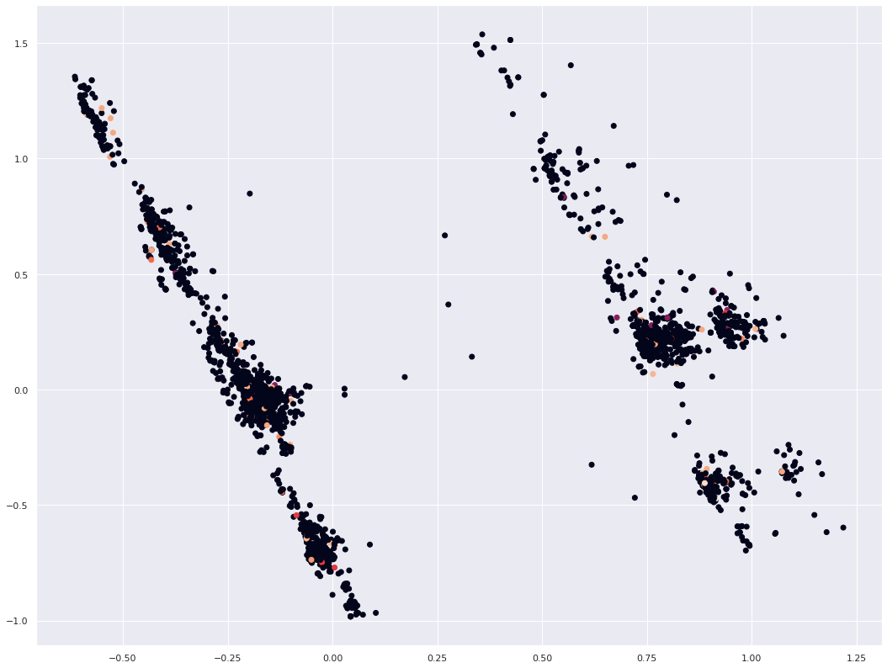


```python
category_id_indices = agg_df.index[~agg_df["category_id"].isna()].tolist()
plt.scatter(X_pca[category_id_indices, 0], X_pca[category_id_indices, 1], c=agg_df.loc[category_id_indices, "category_id"])
plt.show()
```


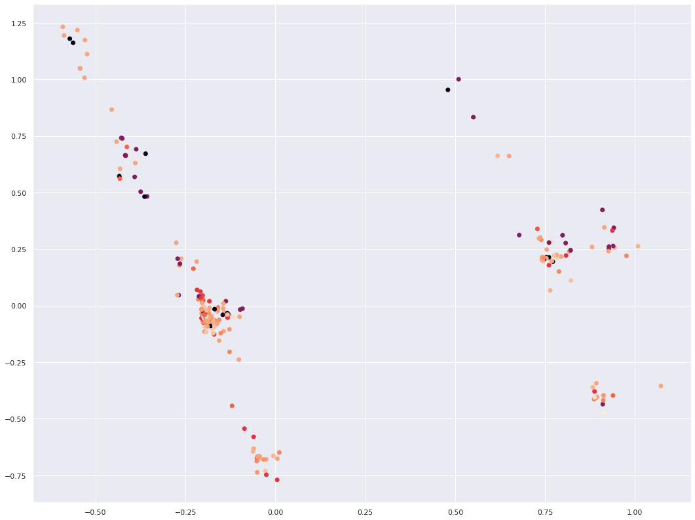


## Apply PCA over all columns, normalized by mean and std


```python

agg_df_embeddings = agg_df[[cname for cname in agg_df.columns if cname.startswith('embed_')]]

def cast_to_list(x):
    if x:
        return [float(num) for num in x[1:-1].replace("\n", "").split(", ") if num]
    else:
        return None


for column in agg_df_embeddings.columns:
    agg_df_embeddings[column] = agg_df_embeddings[column].apply(cast_to_list)

agg_df_embeddings_numeric = pd.concat([
    pd.DataFrame(agg_df_embeddings[colname].values.tolist()).add_prefix(colname + '_')
    for colname in agg_df_embeddings.columns
], axis=1)
```

    <ipython-input-5-5b856c689a4c>:11: SettingWithCopyWarning: 
    A value is trying to be set on a copy of a slice from a DataFrame.
    Try using .loc[row_indexer,col_indexer] = value instead
    
    See the caveats in the documentation: https://pandas.pydata.org/pandas-docs/stable/user_guide/indexing.html#returning-a-view-versus-a-copy
      agg_df_embeddings[column] = agg_df_embeddings[column].apply(cast_to_list)


```python

len(agg_df_embeddings_numeric.columns)
```


    2048


```python
agg_df_numeric = agg_df[[cname for idx, cname in enumerate(agg_df.columns) if agg_df.dtypes[idx] in [np.int64, np.float64]]]
agg_df_not_numeric = agg_df[[cname for idx, cname in enumerate(agg_df.columns) if agg_df.dtypes[idx] not in [np.int64, np.float64]]]
agg_df_embeddings = agg_df[[cname for cname in agg_df.columns if cname.startswith('embed_')]]

agg_df_numeric = pd.concat([agg_df_numeric, agg_df_embeddings_numeric], axis=1)

all_numeric_df = agg_df_numeric.reset_index().fillna(-1).drop(columns=['trending_date', 'category_id'])
normalized_df = (all_numeric_df - all_numeric_df.mean()) / all_numeric_df.std()

X = normalized_df.values
pca = PCA(n_components=5)
X_pca = pca.fit_transform(X)

plt.scatter(X_pca[:, 0], X_pca[:, 1], alpha=0.6)
ax = plt.gca()
plt.show()
```


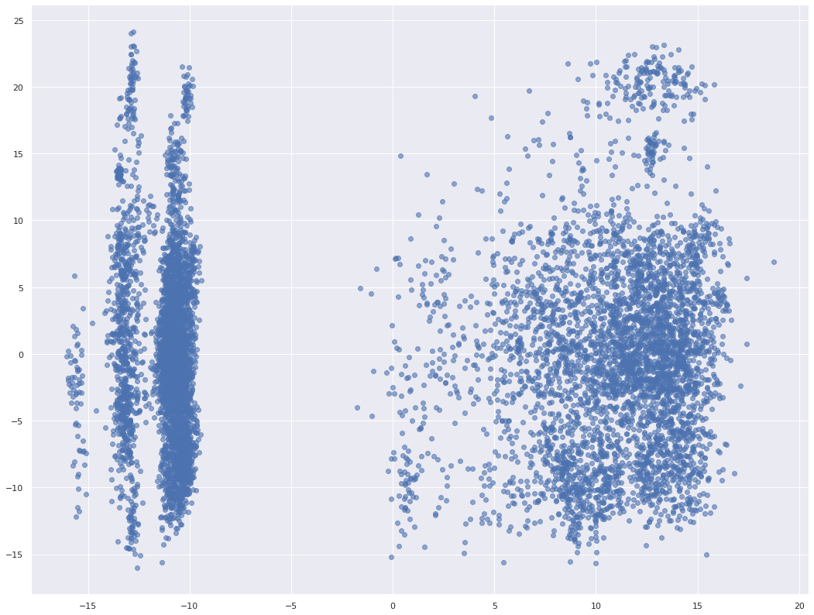


## Select features based on previous checkpoint's analysis


```python
import json

with open(os.path.join("..", "data", "anova_best.json"), "r") as fp:
    ANOVA_BEST = json.load(fp)

with open(os.path.join("..", "data", "chi2_best.json"), "r") as fp:
    CHI2_BEST = json.load(fp)

with open(os.path.join("..", "data", "mi_best.json"), "r") as fp:
    MI_BEST = json.load(fp)

with open(os.path.join("..", "data", "rfecv_best.json"), "r") as fp:
    RFECV_BEST = json.load(fp)

N = 20
SELECT_FEATURES = list(set([*ANOVA_BEST[:N], *CHI2_BEST[:N], *MI_BEST[:N], *RFECV_BEST[:N]]))
len(SELECT_FEATURES), len(agg_df.columns)
```


    (62, 93)


## Apply PCA over SELECTED FEATURES


```python
select_features_df = agg_df_numeric.fillna(0)[SELECT_FEATURES]
normalized_df = (select_features_df - select_features_df.mean()) / select_features_df.std()

X_all = normalized_df.values
y_all = list(map(int, agg_df.fillna(-1).loc[:, "category_id"].values))

pca_all = PCA(n_components=5)
X_pca_all = pca_all.fit_transform(X_all)

import seaborn as sns

sns.scatterplot(
    x='c1', 
    y='c2',
      hue='category',
    size='has_category',
    data=pd.DataFrame({
      'c1': X_pca_all[:, 0],
      'c2': X_pca_all[:, 1],
      'category': list(map(lambda x : categories.get(int(x), "undefined"), y_all)),
        'has_category': list(map(lambda x : 1 if x == -1 else 15, y_all))
  }))
plt.show()
```


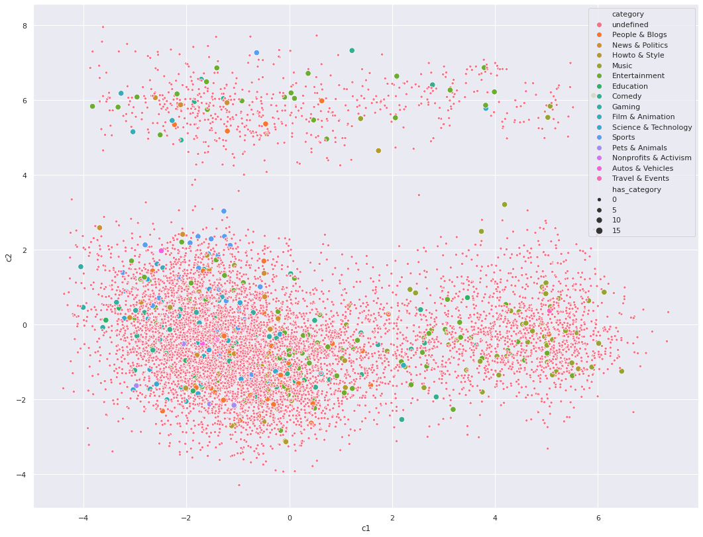


```python
labeled_idx = agg_df.index[~agg_df["category_id"].isna()].tolist()
X = normalized_df.loc[labeled_idx, :].values
y = list(map(int, agg_df.loc[labeled_idx, "category_id"].values))

pca = PCA(n_components=2)
X_pca = pca.fit_transform(X)

import seaborn as sns

sns.scatterplot(
    x='c1', 
    y='c2',
      hue='category',
    data=pd.DataFrame({
      'c1': X_pca[:, 0],
      'c2': X_pca[:, 1],
      'category': list(map(lambda x : categories.get(int(x), "undefined"), y)),
  }))

plt.show()
```


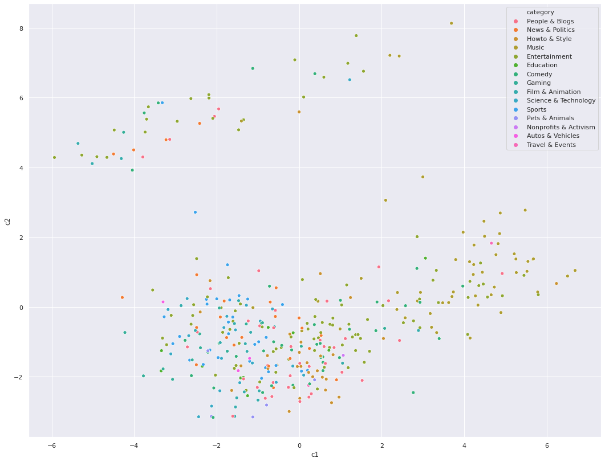


```python
_ = normalized_df.hist(bins=20)
plt.tight_layout()
plt.show()
```


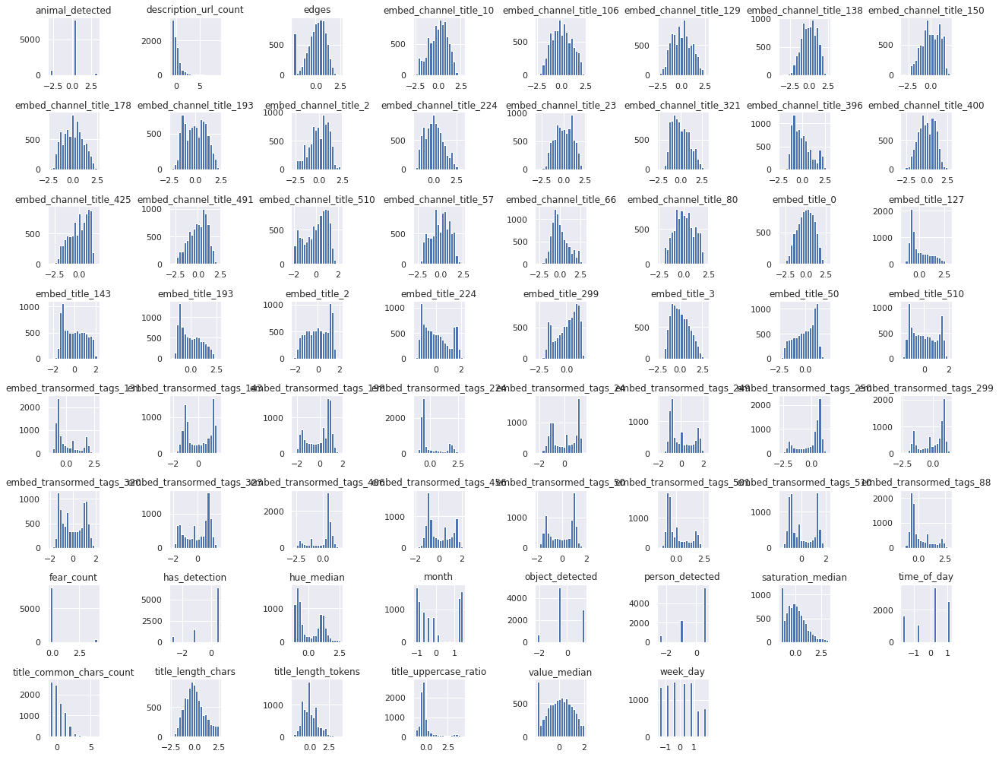


## Distribution of known categories


```python
ax = sns.countplot(
    x="category", 
    data=pd.DataFrame({"category": map(lambda x : categories.get(x),filter(lambda x : x > -1, y_all))})
)
plt.tight_layout()
plt.show()
```


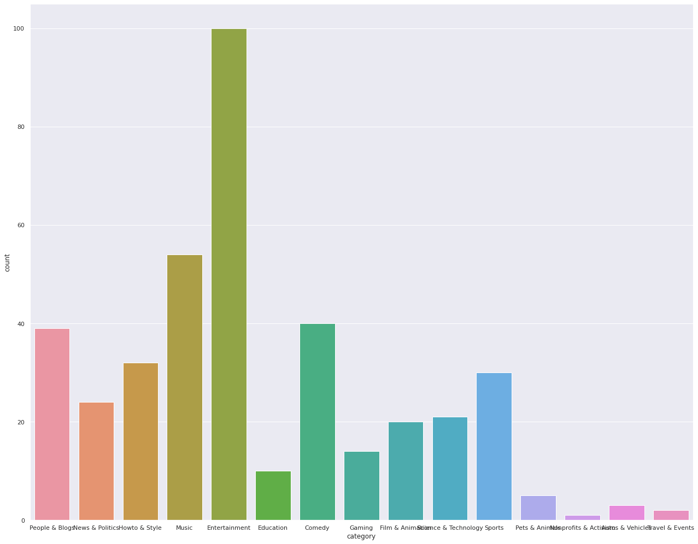


## Try: supervised apprroach vs. naive Self Learning Model


```python
import numpy as np
from sklearn.linear_model.stochastic_gradient import SGDClassifier
from frameworks.SelfLearning import SelfLearningModel

# supervised score 
# basemodel = WQDA() # weighted Quadratic Discriminant Analysis
basemodel = SGDClassifier(loss='log', penalty='l2', random_state=20200501)  # scikit logistic regression
basemodel.fit(X, y)
print("supervised log.reg. score", basemodel.score(X, y))  # 0.8426395939086294

y = np.array(y)
y_all = np.array(y_all)

# # fast (but naive, unsafe) self learning framework
ssmodel = SelfLearningModel(basemodel)
ssmodel.fit(X_all, y_all)
print("self-learning log.reg. score", ssmodel.score(X, y))  # 0.25380710659898476
```

    /home/nawrba/PycharmProjects/PED/venv/lib/python3.8/site-packages/sklearn/utils/deprecation.py:144: FutureWarning: The sklearn.linear_model.stochastic_gradient module is  deprecated in version 0.22 and will be removed in version 0.24. The corresponding classes / functions should instead be imported from sklearn.linear_model. Anything that cannot be imported from sklearn.linear_model is now part of the private API.
      warnings.warn(message, FutureWarning)


    supervised log.reg. score 0.8202531645569621
    self-learning log.reg. score 0.25063291139240507


## Label Spreading


```python
from sklearn.semi_supervised import LabelSpreading

# label_spread = LabelSpreading(kernel='knn', alpha=0.8, max_iter=1000)
label_spread = LabelSpreading(kernel='knn', alpha=0.2, max_iter=1000)

label_spread.fit(X_all, y_all)
```

    /home/nawrba/PycharmProjects/PED/venv/lib/python3.8/site-packages/sklearn/semi_supervised/_label_propagation.py:293: RuntimeWarning: invalid value encountered in true_divide
      self.label_distributions_ /= normalizer


    LabelSpreading(alpha=0.2, gamma=20, kernel='knn', max_iter=1000, n_jobs=None,
                   n_neighbors=7, tol=0.001)


```python
from sklearn.metrics import plot_confusion_matrix
from sklearn.metrics import confusion_matrix, classification_report

y_pred = label_spread.predict(X)
cm = confusion_matrix(y, y_pred, labels=label_spread.classes_)

print(classification_report(y, y_pred))

disp = plot_confusion_matrix(label_spread, X, y,
                                 display_labels=label_spread.classes_,
                                 cmap=plt.cm.Blues)

#               precision    recall  f1-score   support
#            1       0.38      0.75      0.51        20
#            2       0.00      0.00      0.00         3
#           10       0.79      0.91      0.84        54
#           15       1.00      0.60      0.75         5
#           17       0.88      0.76      0.81        29
#           19       0.00      0.00      0.00         2
#           20       0.92      0.79      0.85        14
#           22       0.89      0.82      0.85        39
#           23       0.86      0.78      0.82        40
#           24       0.90      0.86      0.88       100
#           25       0.91      0.83      0.87        24
#           26       0.81      0.94      0.87        32
#           27       0.86      0.60      0.71        10
#           28       0.89      0.76      0.82        21
#           29       1.00      1.00      1.00         1
#     accuracy                           0.82       394
#    macro avg       0.74      0.69      0.71       394
# weighted avg       0.83      0.82      0.82       394
```

    /home/nawrba/PycharmProjects/PED/venv/lib/python3.8/site-packages/sklearn/metrics/_classification.py:1272: UndefinedMetricWarning: Precision and F-score are ill-defined and being set to 0.0 in labels with no predicted samples. Use `zero_division` parameter to control this behavior.
      _warn_prf(average, modifier, msg_start, len(result))


                  precision    recall  f1-score   support
    
               1       0.32      0.70      0.44        20
               2       1.00      0.33      0.50         3
              10       0.90      0.87      0.89        54
              15       1.00      0.60      0.75         5
              17       0.88      0.70      0.78        30
              19       0.00      0.00      0.00         2
              20       0.92      0.86      0.89        14
              22       0.87      0.69      0.77        39
              23       0.72      0.78      0.75        40
              24       0.86      0.88      0.87       100
              25       0.91      0.83      0.87        24
              26       0.82      0.88      0.85        32
              27       0.88      0.70      0.78        10
              28       0.88      0.71      0.79        21
              29       1.00      1.00      1.00         1
    
        accuracy                           0.80       395
       macro avg       0.80      0.70      0.73       395
    weighted avg       0.83      0.80      0.81       395
    


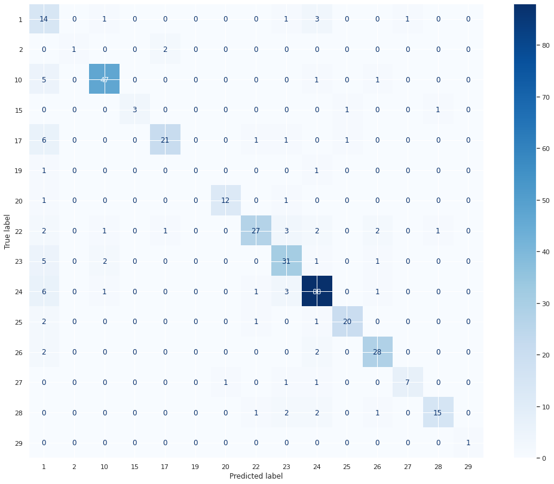


```python
label_spread_pred_all = label_spread.predict(X_all)

sns.scatterplot(
    x='c1', 
    y='c2',
      hue='category',
    size='correct',
    data=pd.DataFrame({
      'c1': X_pca_all[:, 0],
      'c2': X_pca_all[:, 1],
      'category': list(map(lambda x: categories.get(int(x), "undefined"),
                          label_spread_pred_all)),
        'correct': list(map(
            lambda x : 15 if x[0] == x[1] else 1, zip(y_all, label_spread_pred_all)))
  }))

plt.show()
```


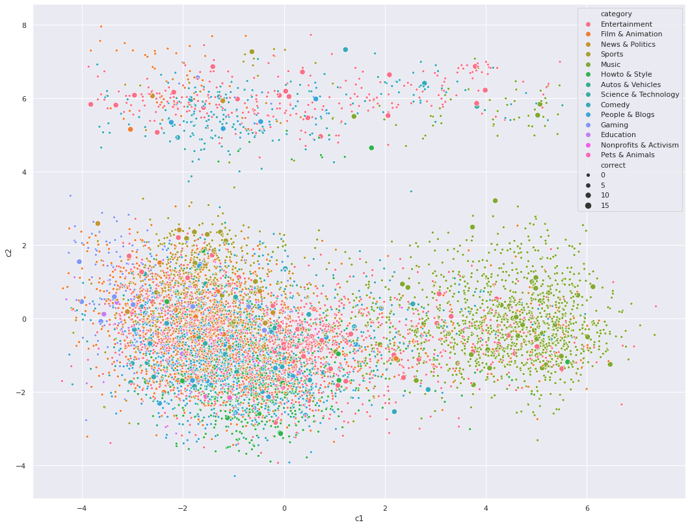


```python

correct_labels_df = pd.read_csv(os.path.join("..", "data", "labels_trending"))
mask_no_missing = correct_labels_df.category_id_true != -1

def plot_validation(y_true_series, y_pred):
    print(classification_report(y_true_series.values, y_pred))

    classes = sorted(y_true_series.unique())

    cm = confusion_matrix(y_true_series.values, y_pred, labels=classes)
    class_labels = [categories[int_class] for int_class in classes]
    sns.heatmap(cm, annot=True, yticklabels=class_labels, xticklabels=class_labels)
    plt.show()

plot_validation(correct_labels_df[mask_no_missing].category_id_true, label_spread_pred_all[mask_no_missing.values])
```

    /home/nawrba/PycharmProjects/PED/venv/lib/python3.8/site-packages/sklearn/metrics/_classification.py:1272: UndefinedMetricWarning: Precision and F-score are ill-defined and being set to 0.0 in labels with no predicted samples. Use `zero_division` parameter to control this behavior.
      _warn_prf(average, modifier, msg_start, len(result))


                  precision    recall  f1-score   support
    
               1       0.17      0.51      0.25       416
               2       0.02      0.01      0.02        67
              10       0.83      0.84      0.84      1300
              15       0.39      0.08      0.14       142
              17       0.80      0.60      0.69       580
              19       0.00      0.00      0.00        62
              20       0.69      0.64      0.66       236
              22       0.35      0.31      0.33       614
              23       0.48      0.57      0.52       576
              24       0.63      0.55      0.59      1987
              25       0.72      0.65      0.68       552
              26       0.60      0.50      0.54       684
              27       0.63      0.39      0.48       257
              28       0.53      0.45      0.49       381
              29       0.09      0.18      0.12        17
    
        accuracy                           0.56      7871
       macro avg       0.46      0.42      0.42      7871
    weighted avg       0.60      0.56      0.57      7871
    


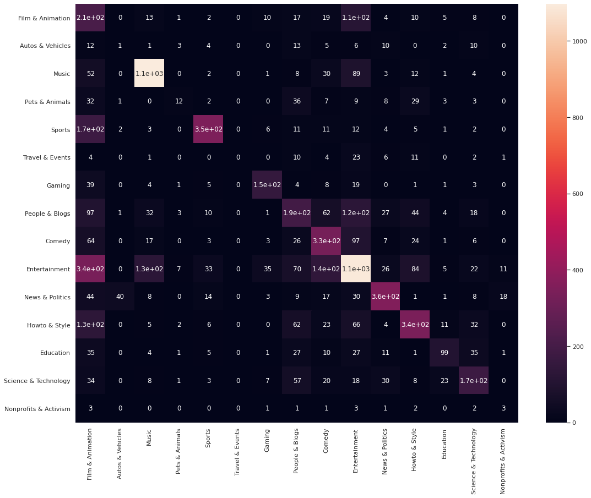


## Entropies


```python
from scipy import stats

# #############################################################################
# Calculate uncertainty values for each transduced distribution
pred_entropies = stats.distributions.entropy(label_spread.label_distributions_.T)
print(pred_entropies.shape)

sns.distplot(pred_entropies)
plt.show()
```

    (8607,)


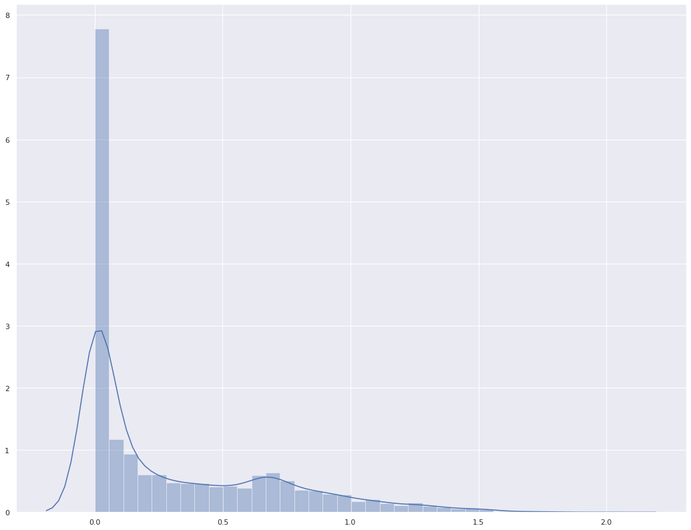


### Read original dataframe to reference original titles & tags


```python
path = "../data/"

GB_videos_df = pd.read_csv(path + "/" + "GB_videos_5p.csv", sep=";", engine="python")
US_videos_df = pd.read_csv(path + "/" + "US_videos_5p.csv", sep=";", engine="python")

df = pd.concat([GB_videos_df, US_videos_df]).drop_duplicates().reset_index(drop=True)
df = df.rename(columns={"description ": "description"})
print(df.shape)
df.head(3) 
```

    (78255, 16)


<div>
<style scoped>
    .dataframe tbody tr th:only-of-type {
        vertical-align: middle;
    }

    .dataframe tbody tr th {
        vertical-align: top;
    }

    .dataframe thead th {
        text-align: right;
    }
</style>
<table border="1" class="dataframe">
  <thead>
    <tr style="text-align: right;">
      <th></th>
      <th>video_id</th>
      <th>trending_date</th>
      <th>title</th>
      <th>channel_title</th>
      <th>category_id</th>
      <th>publish_time</th>
      <th>tags</th>
      <th>views</th>
      <th>likes</th>
      <th>dislikes</th>
      <th>comment_count</th>
      <th>thumbnail_link</th>
      <th>comments_disabled</th>
      <th>ratings_disabled</th>
      <th>video_error_or_removed</th>
      <th>description</th>
    </tr>
  </thead>
  <tbody>
    <tr>
      <th>0</th>
      <td>Jw1Y-zhQURU</td>
      <td>17.14.11</td>
      <td>John Lewis Christmas Ad 2017 - #MozTheMonster</td>
      <td>John Lewis</td>
      <td>NaN</td>
      <td>2017-11-10T07:38:29.000Z</td>
      <td>christmas|"john lewis christmas"|"john lewis"|...</td>
      <td>7224515</td>
      <td>55681</td>
      <td>10247</td>
      <td>9479</td>
      <td>https://i.ytimg.com/vi/Jw1Y-zhQURU/default.jpg</td>
      <td>False</td>
      <td>False</td>
      <td>False</td>
      <td>Click here to continue the story and make your...</td>
    </tr>
    <tr>
      <th>1</th>
      <td>3s1rvMFUweQ</td>
      <td>17.14.11</td>
      <td>Taylor Swift: …Ready for It? (Live) - SNL</td>
      <td>Saturday Night Live</td>
      <td>NaN</td>
      <td>2017-11-12T06:24:44.000Z</td>
      <td>SNL|"Saturday Night Live"|"SNL Season 43"|"Epi...</td>
      <td>1053632</td>
      <td>25561</td>
      <td>2294</td>
      <td>2757</td>
      <td>https://i.ytimg.com/vi/3s1rvMFUweQ/default.jpg</td>
      <td>False</td>
      <td>False</td>
      <td>False</td>
      <td>Musical guest Taylor Swift performs …Ready for...</td>
    </tr>
    <tr>
      <th>2</th>
      <td>n1WpP7iowLc</td>
      <td>17.14.11</td>
      <td>Eminem - Walk On Water (Audio) ft. Beyoncé</td>
      <td>EminemVEVO</td>
      <td>NaN</td>
      <td>2017-11-10T17:00:03.000Z</td>
      <td>Eminem|"Walk"|"On"|"Water"|"Aftermath/Shady/In...</td>
      <td>17158579</td>
      <td>787420</td>
      <td>43420</td>
      <td>125882</td>
      <td>https://i.ytimg.com/vi/n1WpP7iowLc/default.jpg</td>
      <td>False</td>
      <td>False</td>
      <td>False</td>
      <td>Eminem's new track Walk on Water ft. Beyoncé i...</td>
    </tr>
  </tbody>
</table>
</div>


## Least certain


```python
transductions_entropies = list(zip(
    label_spread.transduction_, 
    pred_entropies,
    [i for i in range(len(pred_entropies))]
))

for c in label_spread.classes_:
    print("\nCATEGORY", categories.get(c))
    print(">>> SUPPORT: ", len(list(filter(lambda x : x == c, y_all))), "\n")
    
    t_e_per_class = list(filter(lambda x : x[0] == c, transductions_entropies))
    t_e_per_class = list(sorted(t_e_per_class, key=lambda x : -1*x[1]))
    for _, entropy, idx in t_e_per_class[:5]:
        print(entropy)
        vid_id = agg_df.loc[idx, ["video_id"]].values[0]
        select_from_df = df[df["video_id"] == vid_id]
        print(select_from_df.loc[:, ["title"]].values[0][0])
        print(select_from_df.loc[:, ["tags"]].values[0][0])
        print()
```

    
    CATEGORY Film & Animation
    >>> SUPPORT:  20 
    
    nan
    DON'T WAKE the WOMBAT?!
    funny|"cute"|"baby sloth"|"three toed sloth"|"super cute"|"adorable"|"cutest baby"|"wild"|"adventure"|"adventurous"|"animals"|"breaking trail"|"coyote"|"coyote peterson"|"peterson"|"trail"|"wildife"|"cute sloth"|"cutest sloth ever"|"baby animal"|"cutest animal"|"cute video"|"possum"|"worlds cutest possum"|"cute possum"|"baby possum"|"brushtail possum"|"marsupial"|"australia"|"cutest possum ever"|"baby animals"|"tiny possum"|"dont wake the wombat"|"wombat"|"wombats"|"sleeping wombat"|"try not to laugh"|"funny videos"|"wambat"
    
    nan
    Joe Rogan Experience #1119 - Howard Bloom
    Joe Rogan Experience|"podcast"|"Joe Rogan"|"Howard Bloom"|"JRE #1119"|"1119"|"comedy"|"comedian"|"jokes"|"stand up"|"funny"|"mma"|"UFC"|"physics"|"Ultimate Fighting Championship"
    
    nan
    I guess I'll talk about Ready Player One
    [none]
    
    nan
    Best of the Worst: Plinketto #6
    redlettermedia|"red letter media"|"red"|"letter"|"media"|"plinkett"|"half in the bag"|"mike stoklasa"|"jay bauman"|"rich evans"|"Best of the Worst"|"Plinketto"
    
    nan
    Will It Watermarble?! Sister Edition | Watermarbling 9 random objects in nail polish!
    nails|"nail art"|"nail tutorial"|"beauty tutorial"|"nail art tutorial"|"diy nails"|"easy nail art"|"diy nail art"|"cute nail art"|"simply nailogical"|"simplynailogical sister"|"simplynailogical jen"|"jenny"|"iphone"|"what's on my iphone"|"phone games"|"best fiends"|"sister fun"|"watermarble"|"will it watermarble"|"simplynailogical watermarble"|"watermarble nails"|"watermarble objects"|"hydrodipping"|"marble"|"nail polish marble"
    
    
    CATEGORY Autos & Vehicles
    >>> SUPPORT:  3 
    
    1.5712725948838777
    Why the Oscars love method actors
    vox.com|"vox"|"explain"|"oscars"|"2018 oscars"|"method acting"|"method actors"|"famous method actors"|"best method actors"|"what is method acting"|"method acting explainer"|"leonardo dicaprio"|"leonardo dicaprio oscar"|"best method acting performances"|"the revenant"|"heath ledger"|"daniel day lewis"|"daniel day-lewis"|"the dark knight joker"|"famous method acting performances"
    
    1.2589625615972226


    ---------------------------------------------------------------------------

    IndexError                                Traceback (most recent call last)

    <ipython-input-74-25987e30ca5f> in <module>
         15         vid_id = agg_df.loc[idx, ["video_id"]].values[0]
         16         select_from_df = df[df["video_id"] == vid_id]
    ---> 17         print(select_from_df.loc[:, ["title"]].values[0][0])
         18         print(select_from_df.loc[:, ["tags"]].values[0][0])
         19         print()


    IndexError: index 0 is out of bounds for axis 0 with size 0


## Most certain


```python
transductions_entropies = list(zip(
    label_spread.transduction_, 
    pred_entropies,
    [i for i in range(len(pred_entropies))]
))

for c in label_spread.classes_:
    print("\nCATEGORY", categories.get(c))
    print(">>> SUPPORT: ", len(list(filter(lambda x : x == c, y_all))), "\n")
    
    t_e_per_class = list(filter(lambda x : x[0] == c, transductions_entropies))
    t_e_per_class = list(sorted(t_e_per_class, key=lambda x : x[1]))
    for _, entropy, idx in t_e_per_class[:5]:
        print(entropy)
        vid_id = agg_df.loc[idx, ["video_id"]].values[0]
        select_from_df = df[df["video_id"] == vid_id]
        if select_from_df.shape[0] > 0:
            print(select_from_df.loc[:, ["title"]].values[0][0])
            print(select_from_df.loc[:, ["tags"]].values[0][0][:100])
            print()
```

# 2 Method: Gaussian Mixture Model

First (bad) implementation found at kaggle site


```python

# import numpy as np
# from scipy import stats


# class SSGaussianMixture(object):
#     def __init__(self, n_features, n_categories):
#         self.n_features = n_features
#         self.n_categories = n_categories

#         self.mus = np.array([np.random.randn(n_features)] * n_categories)
#         self.sigmas = np.array([np.eye(n_features)] * n_categories)
#         self.pis = np.array([1 / n_categories] * n_categories)

#     def fit(self, X_train, y_train, X_test, threshold=0.00001, max_iter=100):
#         Z_train = np.eye(self.n_categories)[y_train]

#         for i in range(max_iter):
#             # EM algorithm
#             # M step
#             Z_test = np.array([self.gamma(X_test, k) for k in range(self.n_categories)]).T
#             Z_test /= Z_test.sum(axis=1, keepdims=True)

#             # E step
#             datas = [X_train, Z_train, X_test, Z_test]
#             mus = np.array([self._est_mu(k, *datas) for k in range(self.n_categories)])
#             sigmas = np.array([self._est_sigma(k, *datas) for k in range(self.n_categories)])
#             pis = np.array([self._est_pi(k, *datas) for k in range(self.n_categories)])

#             diff = max(np.max(np.abs(mus - self.mus)),
#                        np.max(np.abs(sigmas - self.sigmas)),
#                        np.max(np.abs(pis - self.pis)))

#             print(f"{i + 1}/{max_iter} diff = {diff} conv matrix max = {np.max(sigmas)} min {np.min(sigmas)}")
#             self.mus = mus
#             self.sigmas = sigmas
#             self.pis = pis
#             if diff < threshold:
#                 break

#     def predict_proba(self, X):
#         Z_pred = np.array([self.gamma(X, k) for k in range(self.n_categories)]).T
#         Z_pred /= Z_pred.sum(axis=1, keepdims=True)
#         return Z_pred

#     def gamma(self, X, k):
#         # X is input vectors, k is feature index
#         return stats.multivariate_normal.pdf(X, mean=self.mus[k], cov=self.sigmas[k], allow_singular=True)

#     def _est_mu(self, k, X_train, Z_train, X_test, Z_test):
#         mu = (Z_train[:, k] @ X_train + Z_test[:, k] @ X_test).T / \
#              (Z_train[:, k].sum() + Z_test[:, k].sum())
#         return mu

#     def _est_sigma(self, k, X_train, Z_train, X_test, Z_test):
#         cmp1 = (X_train - self.mus[k]).T @ np.diag(Z_train[:, k]) @ (X_train - self.mus[k])
#         cmp2 = (X_test - self.mus[k]).T @ np.diag(Z_test[:, k]) @ (X_test - self.mus[k])
#         sigma = (cmp1 + cmp2) / (Z_train[:, k].sum() + Z_test[:k].sum())
#         return sigma

#     def _est_pi(self, k, X_train, Z_train, X_test, Z_test):
#         pi = (Z_train[:, k].sum() + Z_test[:, k].sum()) / \
#              (Z_train.sum() + Z_test.sum())
#         return pi

# # Below is just a lapper object.

# from sklearn.preprocessing import StandardScaler
# from sklearn.pipeline import Pipeline

# from sklearn import preprocessing


# class BaseClassifier(object):
#     def __init__(self, n_categories):
#         self.n_categories = n_categories
#         self.preprocess = Pipeline([('scaler', StandardScaler())])
#         self.label_encoder = preprocessing.LabelEncoder()

#     def fit(self, X_train, y_train, X_test, max_iter=10, cv_qda=2, cv_meta=2):
#         X_train_org = X_train
#         self.label_encoder.fit(y_train)
#         y_train = self.label_encoder.transform(y_train)

#         self.preprocess_tune(np.vstack([X_train, X_test]))
#         X_train = self.preprocess.transform(X_train)
#         X_test = self.preprocess.transform(X_test)

#         self.cgm = SSGaussianMixture(
#             n_features=X_train.shape[1],
#             n_categories=self.n_categories,
#         )
#         _, unique_counts = np.unique(y, return_counts=True)
#         self.cgm.pis = unique_counts / np.sum(unique_counts)
#         self.cgm.fit(X_train, y_train, X_test, max_iter=max_iter)

#     def predict(self, X):
#         X = self.preprocess.transform(X)
#         y_prob = self.cgm.predict_proba(X)
#         y = np.argmax(y_prob, axis=-1)
#         return self.label_encoder.inverse_transform(y)

#     def preprocess_tune(self, X):
#         self.preprocess.fit(X)

#     def validation(self, X, y):
#         y_pred = self.predict(X)

#         cm = confusion_matrix(y, y_pred)  # , labels=label_spread.classes_)

#         print(classification_report(y, y_pred))

#         sns.heatmap(cm, annot=True)
#         plt.show()

# n_categoties = len(np.unique(y))
# bc = BaseClassifier(n_categoties)
```

### Findig correlated embeddings features


```python
corr_mat = pd.DataFrame(X_all).corr()
plt.matshow(corr_mat)
```


    <matplotlib.image.AxesImage at 0x7fe337e5e340>


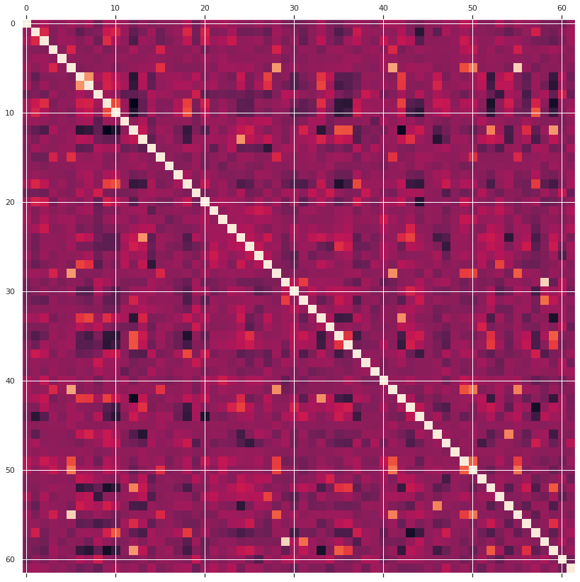


```python
np.max(np.max(corr_mat[corr_mat != 1])), np.min(np.min(corr_mat))
```


    (0.9042718723857275, -0.5620809080436634)


```python
np.array([
    pair
    for pair in 
    np.concatenate([np.array(np.where(np.logical_and(corr_mat > 0.5, corr_mat < 1.0))).T, np.array(np.where(corr_mat < -0.5)).T])
    if pair[0] < pair[1]
])
```


    array([[ 5, 28],
           [ 5, 41],
           [ 5, 50],
           [ 5, 55],
           [ 6,  7],
           [12, 52],
           [12, 59],
           [13, 24],
           [28, 41],
           [29, 58],
           [31, 58],
           [33, 42],
           [41, 50],
           [41, 55],
           [46, 54],
           [50, 55],
           [ 9, 12],
           [12, 42]])


Removing corelated features


```python
# Decided to remove
to_be_removed = [5, 12, 41, 58, 6, 13, 33, 46, 50]
cleaned_X_all = np.delete(X_all, to_be_removed, axis=1)
cleaned_X = np.delete(X, to_be_removed, axis=1)

corr_mat = pd.DataFrame(cleaned_X_all).corr()
plt.matshow(corr_mat)
```


    <matplotlib.image.AxesImage at 0x7fe3379520d0>


```python
np.max(np.max(corr_mat[corr_mat != 1])), np.min(np.min(corr_mat))
```


    (0.47197046162753775, -0.4823026394372298)


```python
cleaned_X_no_labels = cleaned_X_all[y_all == -1]
```


```python
np.unique(cleaned_X_no_labels, axis=0).shape, cleaned_X_no_labels.shape
```


    ((8212, 53), (8212, 53))


```python
cleaned_X_no_labels.shape, cleaned_X_no_labels[:,:20].shape
```


    ((8212, 53), (8212, 20))


### First approach generating very poor results


```python
# bc.fit(cleaned_X, y, cleaned_X_no_labels, max_iter=20)
# bc.validation(cleaned_X, y)
```

### Our implementation of SSGMM


```python
unique_labels = list(np.unique(y))
```


```python

from scipy.stats import multivariate_normal
import bidict
label_mapping = bidict.bidict({
    label_original: label_encoded
    for label_original, label_encoded in zip(unique_labels + [-1], list(range(len(unique_labels))) + [-1])
})


def get_probs_ssgmm(X, y, num_iterations=5):
    y = np.array([
        label_mapping[sing_y]
        for sing_y in y
    ])
    num_samples, n_features = X.shape
    unique_labels, unique_counts = np.unique(y, return_counts=True)
    unique_counts = unique_counts[unique_labels != -1]
    n_categories = len(unique_labels) - 1  # there is additional -1 label

    means = np.array([np.random.randn(n_features)] * n_categories)
    covs = np.array([np.eye(n_features)] * n_categories)
    qs = unique_counts / np.sum(unique_counts)

    print(means.shape)

    for iters in range(num_iterations):
        Pij = np.zeros((num_samples, n_categories))
        for i in range(num_samples):
            if y[i] == -1:
                ps = np.array([
                    multivariate_normal.pdf(X[i], means[cat_num], covs[cat_num], allow_singular=True) * q
                    for cat_num, q in zip(range(n_categories), qs)
                ])
                Pij[i] = ps / sum(ps)
            else:
                ps = np.zeros(n_categories)
                ps[y[i]] = 1
                Pij[i] = ps
        n = np.sum(Pij, axis=0)

        new_means = np.array([
            np.dot(Pij[:, cat_num], X) / n[cat_num]
            for cat_num in range(n_categories)
        ])
        diff = np.max(np.abs(means - new_means))
        means = new_means

        new_qs = n / float(num_samples)
        diff = max(np.max(np.abs(qs - new_qs)), diff)
        qs = new_qs

        old_covs = covs
        covs = np.zeros((n_categories, n_features, n_features))
        for t in range(num_samples):
            for cat_num in range(n_categories):
                covs[cat_num] += Pij[t, cat_num] * np.outer(X[t] - means[cat_num], X[t] - means[cat_num])

        for cat_num in range(n_categories):
            covs[cat_num] /= n[cat_num]

        diff = max(np.max(np.abs(old_covs - covs)), diff)
        print(f"{iters + 1} / {num_iterations} diff = {diff}")
    return Pij, [means, covs, qs]


probs, [means, covs, qs] = get_probs_ssgmm(cleaned_X_all, y_all, num_iterations=7)
```

    (15, 53)
    1 / 7 diff = 2.4762136535373744
    2 / 7 diff = 1.8587910777275372
    3 / 7 diff = 2.043899372545016
    4 / 7 diff = 1.335358465356557
    5 / 7 diff = 1.5971789970981123
    6 / 7 diff = 0.21228116447723666
    7 / 7 diff = 0.45926392843269426


### GMM results analysis


```python
def predict_proba(X, means, covs, qs):
    num_samples, n_features = X.shape
    n_categories = len(unique_labels)
    Pij = np.zeros((num_samples, n_categories))
    for i in range(num_samples):
        ps = np.array([
            multivariate_normal.pdf(X[i], means[cat_num], covs[cat_num], allow_singular=True) * q
            for cat_num, q in zip(range(n_categories), qs)
        ])
        Pij[i] = ps / sum(ps)
        
        if (i + 1) % 500 == 0:
            print(f"Step {i+1}/{num_samples}")
    return Pij

gmm_y_proba = predict_proba(cleaned_X, means, covs, qs)

gmm_y_pred = np.array([label_mapping.inverse[label] for label in np.argmax(gmm_y_proba, axis=-1)])
    
print(classification_report(y, gmm_y_pred))
    
cm = confusion_matrix(y, gmm_y_pred)
sns.heatmap(cm, annot=True)
plt.show()
```

                  precision    recall  f1-score   support
    
               1       0.64      0.70      0.67        20
               2       0.33      1.00      0.50         3
              10       0.53      0.70      0.60        54
              15       0.62      1.00      0.77         5
              17       1.00      0.70      0.82        30
              19       0.50      0.50      0.50         2
              20       0.92      0.86      0.89        14
              22       0.28      0.62      0.38        39
              23       0.63      0.42      0.51        40
              24       0.80      0.37      0.51       100
              25       0.95      0.75      0.84        24
              26       0.70      0.59      0.64        32
              27       0.54      0.70      0.61        10
              28       0.68      0.71      0.70        21
              29       0.12      1.00      0.22         1
    
        accuracy                           0.59       395
       macro avg       0.62      0.71      0.61       395
    weighted avg       0.69      0.59      0.60       395
    


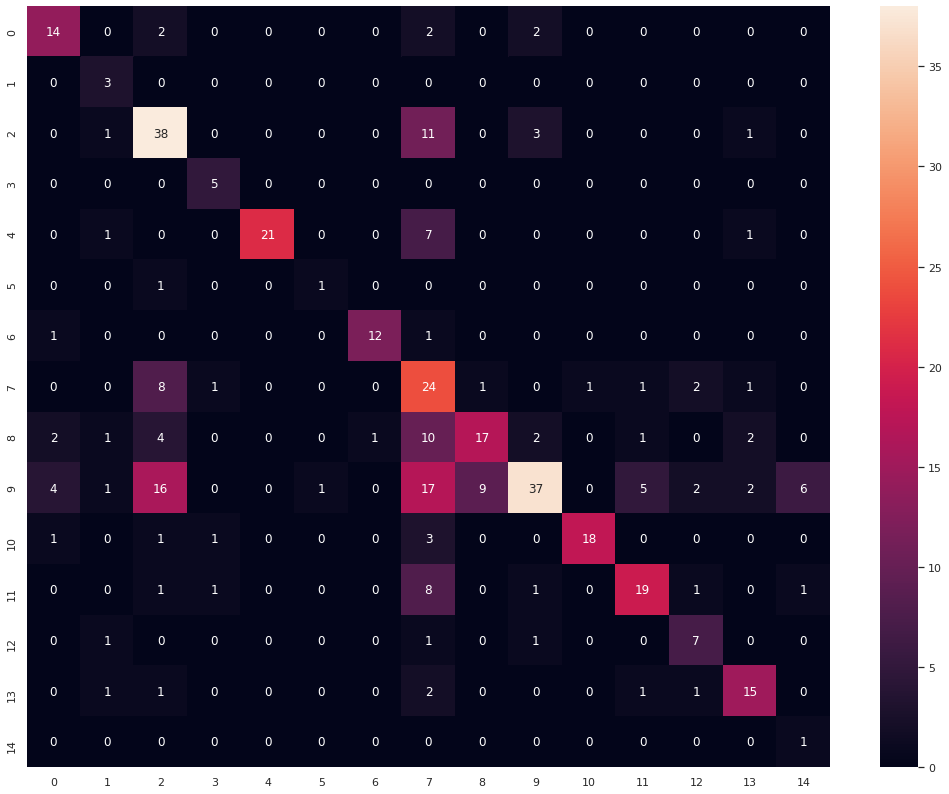


```python
gmm_y_all_proba = predict_proba(cleaned_X_all, means, covs, qs)
gmm_y_all_pred = np.array([label_mapping.inverse[label] for label in np.argmax(gmm_y_all_proba, axis=-1)])


print("predicted")
sns.scatterplot(
    x='c1', 
    y='c2',
      hue='category',
    size='correct',
    data=pd.DataFrame({
      'c1': X_pca_all[:, 0],
      'c2': X_pca_all[:, 1],
      'category': list(map(lambda x: categories.get(int(x), "undefined"),
                          gmm_y_all_pred)),
        'correct': list(map(
            lambda x : 15 if x[0] == x[1] else 1, zip(y_all, gmm_y_all_pred)))
  }))

plt.show()
```

    Step 500/8607
    Step 1000/8607
    Step 1500/8607
    Step 2000/8607
    Step 2500/8607
    Step 3000/8607
    Step 3500/8607
    Step 4000/8607
    Step 4500/8607
    Step 5000/8607
    Step 5500/8607
    Step 6000/8607
    Step 6500/8607
    Step 7000/8607
    Step 7500/8607
    Step 8000/8607
    Step 8500/8607
    predicted


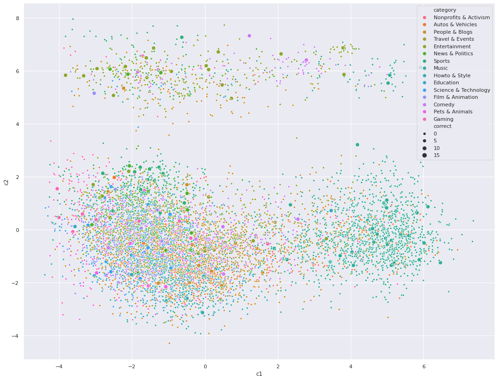


```python
correct_labels_df = pd.read_csv(os.path.join("..", "data", "labels_trending"))

plot_validation(correct_labels_df[mask_no_missing].category_id_true, gmm_y_all_pred[mask_no_missing.values])
```

                  precision    recall  f1-score   support
    
               1       0.31      0.44      0.36       416
               2       0.02      0.06      0.03        67
              10       0.65      0.71      0.68      1300
              15       0.27      0.37      0.31       142
              17       0.97      0.71      0.82       580
              19       0.01      0.02      0.01        62
              20       0.67      0.69      0.68       236
              22       0.17      0.40      0.24       614
              23       0.61      0.40      0.48       576
              24       0.59      0.18      0.28      1987
              25       0.72      0.65      0.68       552
              26       0.61      0.52      0.56       684
              27       0.37      0.38      0.38       257
              28       0.41      0.57      0.48       381
              29       0.01      0.18      0.02        17
    
        accuracy                           0.46      7871
       macro avg       0.43      0.42      0.40      7871
    weighted avg       0.56      0.46      0.47      7871
    


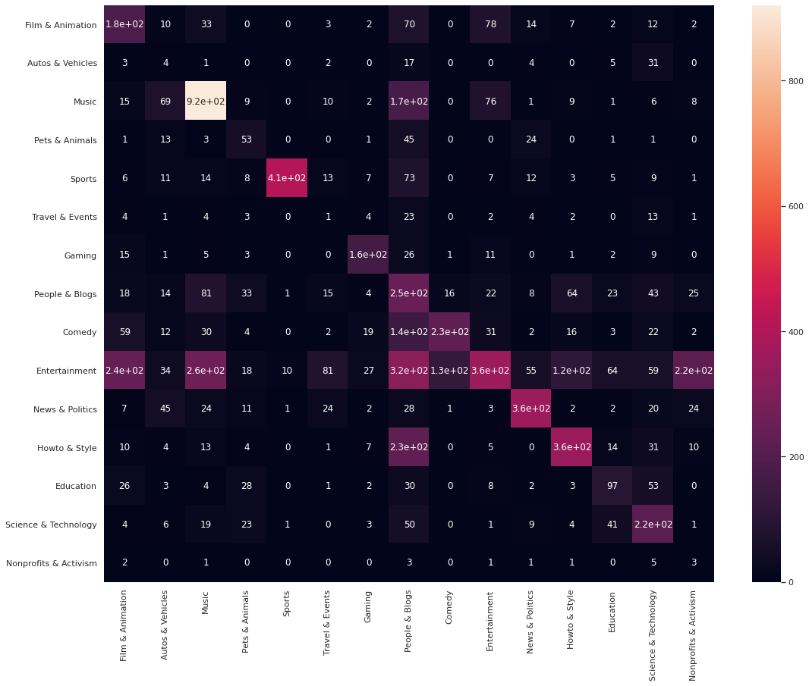


```python
from scipy import stats

# #############################################################################
# Calculate uncertainty values for each transduced distribution
pred_entropies = stats.distributions.entropy(gmm_y_all_proba.T)
print(pred_entropies.shape)

sns.distplot(pred_entropies)
plt.show()
```

    (8607,)


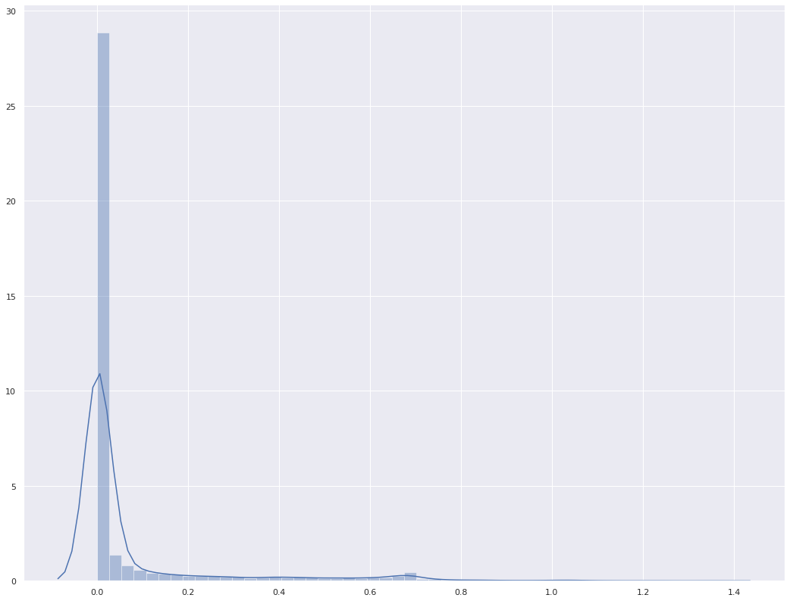


```python
transductions_entropies = list(zip(
    gmm_y_all_pred, 
    pred_entropies,
    [i for i in range(len(pred_entropies))]
))

for c in label_spread.classes_:
    print("\nCATEGORY", categories.get(c))
    print(">>> SUPPORT: ", len(list(filter(lambda x : x == c, y_all))), "\n")
    
    t_e_per_class = list(filter(lambda x : x[0] == c, transductions_entropies))
    t_e_per_class = list(sorted(t_e_per_class, key=lambda x : x[1]))
    for _, entropy, idx in t_e_per_class[:5]:
        print(entropy)
        vid_id = agg_df.loc[idx, ["video_id"]].values[0]
        select_from_df = df[df["video_id"] == vid_id]
        if select_from_df.shape[0] > 0:
            print(select_from_df.loc[:, ["title"]].values[0][0])
            print(select_from_df.loc[:, ["tags"]].values[0][0][:100])
            print()
```

    
    CATEGORY Film & Animation
    >>> SUPPORT:  20 
    
    2.659118600456281e-16
    PADDINGTON 2 - Full US Trailer
    Paddington|"Paddington 2"|"Paddington Bear"|"Paddington Brown"|"Hugh Bonneville"|"Sally Hawkins"|"Ju
    
    3.747520164869952e-15
    Honest Trailers - It (2017)
    it|"it 2017"|"it movie"|"stephen king"|"stephen king it"|"stephen king's it"|"it the clown"|"pennywi
    
    1.2742021916163487e-14
    Film Theory: How To SAVE Jurassic Park (Jurassic World)
    Jurassic|"jurassic world"|"jurassic park"|"jurassic world 2"|"jurassic world 2 trailer"|"Jurassic wo
    
    1.4339730535155394e-14
    Honest Trailers - Jumanji
    screen junkies|"screenjunkies"|"honest trailers"|"honest trailer"|"the rock"|"kevin hart"|"jack blac
    
    3.945822769026652e-11
    The First Purge Trailer #1 (2018) | Movieclips Trailers
    The First Purge Trailer|"The First Purge Movie Trailer"|"The First Purge Trailer 2018"|"Official Tra
    
    
    CATEGORY Autos & Vehicles
    >>> SUPPORT:  3 
    
    5.388697235563113e-23
    AREA21 - Glad You Came  (Official Music Video)
    area21|"area 21"|"martin Garrix"|"Garrix"|"Glad You Came"|"Doesn't really matter"|"STMPD"|"STMPD RCR
    
    7.046810437916641e-21
    Head Over Heels (A Valentines Special) - Simon's Cat | BLACK & WHITE
    cartoon|"simons cat"|"simon's cat"|"simonscat"|"simon the cat"|"funny cats"|"cute cats"|"cat fails"|
    
    1.6565306163268813e-19
    Big Sean - Pull Up N Wreck (feat. 21 Savage) [Prod. By SouthSide & Metro Boomin]
    big sean|"pull up n wreck"|"21 savage"|"metro boomin"|"double or nothing"
    
    2.6832402518259293e-19
    Diplo - Get It Right (Feat. MØ) (Official Lyric Video)
    Get It Right Diplo feat. Mø|"Get it Right"|"Get It Right Song"|"Major Lazer"|"Give Me Future Soundtr
    
    1.2147107360456626e-18
    NASA's plan to save Earth from a giant asteroid
    vox.com|"vox"|"explain"|"gravity tractor"|"nasa asteroids"|"asteroid collision"|"asteroids"|"asteroi
    
    
    CATEGORY Music
    >>> SUPPORT:  54 
    
    1.0656011554275987e-17
    Marshmello & Logic - EVERYDAY (Audio)
    everyday|"marshmello"|"Marshmello & Logic - Everyday"|"marshmello logic"|"logic"|"logic everyday"|"m
    
    2.1864387048257152e-17
    Anitta - Vai Malandra (Alesso & KO:YU Remix) with Anwar Jibawi | Official Video
    anitta vai malandra alesso koyu remix with anwar jibawi|"official"|"video"|"anitta"|"vai"|"malandra"
    
    9.58221626854404e-17
    Marshmello - Fly (Official Music Video)
    marshmello|"marshmello fly"|"fly"|"fly marshmello"|"i can fly"|"marshmello i can fly"|"i can fly mar
    
    1.1042990554914852e-16
    Marshmello x Juicy J - You Can Cry (Ft. James Arthur) (Official Video)
    you can cry|"you can cry music video"|"you can cry lyrics"|"you can cry lyric video"|"marshmello"|"j
    
    2.1979008780622868e-16
    Marshmello - TELL ME
    marshmello|"Tell Me"|"marshmello tell me"|"marshmallow"|"you and me"|"keep it mello"|"dance"|"tomorr
    
    
    CATEGORY Pets & Animals
    >>> SUPPORT:  5 
    
    1.7422311005326167e-19
    BITTEN by a GIANT DESERT CENTIPEDE!
    adventure|"adventurous"|"animals"|"brave"|"brave wilderness"|"breaking"|"breaking trail"|"coyote"|"c
    
    8.837147441460162e-19
    Will it Slice? SLICER 5 000 000 Vs. Frying pan and Paper!
    Hydraulic press channel|"hydraulicpresschannel"|"hydraulic press"|"hydraulicpress"|"crush"|"willitcr
    
    3.864599977447815e-18
    Can You Turn Hair to Stone with Hydraulic Press?
    Hydraulic press channel|"hydraulicpresschannel"|"hydraulic press"|"hydraulicpress"|"crush"|"willitcr
    
    7.227057125388254e-16
    Look At This Pups Leg!
    dog|"dogs"|"animal"|"animals"|"vet"|"vetranch"|"drkarri"|"drmatt"|"surgery"|"veterinarian"|"puppy"|"
    
    1.2919538648049888e-14
    巨大なうさぎを癒すねこ。-Maru heals the huge rabbit.-
    Maru|"cat"|"kitty"|"pets"|"まる"|"猫"|"ねこ"
    
    
    CATEGORY Sports
    >>> SUPPORT:  30 
    
    4.666756752759322e-27
    Packers vs. Steelers | NFL Week 12 Game Highlights
    NFL|"Football"|"offense"|"defense"|"afc"|"nfc"|"American Football"|"highlight"|"highlights"|"game"|"
    
    4.247970982954216e-24
    Stephen Curry Returns with 38 Pts and 10 Threes | December 30, 2017
    nba|"highlights"|"basketball"|"plays"|"amazing"|"sports"|"hoops"|"finals"|"games"|"game"|"stephen"|"
    
    3.944861334988877e-23
    Patriots vs. Steelers | NFL Week 15 Game Highlights
    NFL|"Football"|"offense"|"defense"|"afc"|"nfc"|"American Football"|"highlight"|"highlights"|"game"|"
    
    6.548472541864825e-23
    LeBron James Pulls a SWEET Behind-the-Back Move Between Tristan Thompson's Legs!
    nba|"highlights"|"basketball"|"plays"|"amazing"|"sports"|"hoops"|"finals"|"games"|"game"|"lebron"|"j
    
    7.367824974334305e-23
    Giants vs. 49ers | NFL Week 10 Game Highlights
    NFL|"Football"|"offense"|"defense"|"afc"|"nfc"|"American Football"|"highlight"|"highlights"|"game"|"
    
    
    CATEGORY Travel & Events
    >>> SUPPORT:  2 
    
    8.333741096615419e-20
    A Metal Waterfall
    best vines 2018|"funny vines"|"funny videos"|"funniest videos 2018"
    
    2.032112448699247e-19
    A Thirsty Sidewalk
    best vines 2018|"funny vines"|"funny videos"|"funniest videos 2018"
    
    2.8277230919107275e-18
    The Smallest House In The World
    best vines 2018|"funny vines"|"funny videos"|"funniest videos 2018"
    
    3.4351406368019815e-17
    Rep. Nancy Pelosi (D-CA) finds out she's given the longest-continuous speech in the House (C-SPAN)
    Nancy Pelosi|"House of Representatives"|"C-SPAN"|"CSPAN"|"Congress"|"filibuster"
    
    4.3202587426089256e-17
    UFC 220: Official Weigh-in
    ufc|"mma"|"ufc 220"|"220"|"francis ngannou"|"stipe miocic"|"volkan oezdemir"|"daniel cormier"|"calvi
    
    
    CATEGORY Gaming
    >>> SUPPORT:  14 
    
    2.6079871938920627e-17
    6.32340196336463e-13
    Nintendo @ E3 2018: Day 2
    nintendo|"play"|"play nintendo"|"game"|"gameplay"|"fun"|"video game"|"kids"|"action"|"E3 2018"|"Tree
    
    2.49739808514629e-12
    Nintendo Direct 3.8.2018
    nintendo|"play"|"game"|"gameplay"|"fun"|"video game"|"action"|"rpg"|"nintendo direct"|"nintendo swit
    
    8.142516665791352e-12
    For Honor: Season 4 - Frost Wind Festival Launch Trailer | Ubisoft [US]
    for honor|"for honor trailer"|"for honor single player"|"for honor campaign"|"for honor story"|"trai
    
    1.0830606402684287e-11
    The Legend of Zelda: Breath of the Wild - Expansion Pass: DLC Pack 2 The Champions’ Ballad Trailer
    nintendo|"play"|"play nintendo"|"game"|"gameplay"|"fun"|"video game"|"kids"|"action"|"adventure"|"rp
    
    
    CATEGORY People & Blogs
    >>> SUPPORT:  39 
    
    7.815011288928521e-19
    SHOULD I HAVE A HOME BIRTH?
    jamie and nikki|"family vlog"|"daily vlog"|"beauty guru"|"pregnancy"|"make up"|"toddler"|"black"|"af
    
    2.6818548948917308e-18
    ENDURO SKATEPARK MTB!!
    MTB|"MTB ENDURO"|"MTB DOWNHILL"|"MTB SLOPESTYLE"|"MTB HILL"|"MTB SLOPE"|"BIKE RIDE"|"MOUNTAIN BIKE"|
    
    9.741571143652165e-17
    RIDING MY NEW DOWNHILL MTB!!!
    MTB|"MTB DOWNHILL"|"DOWNHILL"|"MTB CRANKWORX"|"MTB RAMPAGE"|"MTB CRASHES"|"MTB HARDLINE"|"MTB WHISTL
    
    1.091868912786504e-15
    REACTING TO MY OLD GYMNASTICS WITH MY DAD!
    nile wilson|"nile wilson gymnastics"|"nile wilson olympics"|"olympic gymnast"|"amazing gymnastics"|"
    
    1.204674205580525e-13
    MAKING A GINGERBREAD TRAIN
    marzia|"cutiepie"|"cutiepiemarzia"|"pie"|"cute"|"cutie"|"marzipans"|"how-to"|"vlog"|"pugs"|"xas"|"ch
    
    
    CATEGORY Comedy
    >>> SUPPORT:  40 
    
    4.089353346192782e-21
    Amber Explains How Black Women Saved America from Roy Moore
    late night|"seth meyers"|"trump"|"Amber Ruffin"|"Roy Moore"|"Alabama"|"NBC"|"NBC TV"|"television"|"f
    
    3.2682528581339394e-20
    Trump's Spygate Claims; Michael Cohen’s Taxi King Partner: A Closer Look
    Late|"Night"|"with"|"Seth"|"Meyers"|"seth meyers"|"late night with seth meyers"|"steven wolf"|"david
    
    4.983123239127448e-20
    Trump, Stormy Daniels and a Possible Government Shutdown: A Closer Look
    late night|"seth meyers"|"closer look"|"trump"|"stormy daniels"|"government shutdown"|"NBC"|"NBC TV"
    
    5.613400861730962e-20
    Trump Attacks Trudeau as He Heads to Kim Jong-un Summit: A Closer Look
    Late|"Night"|"with"|"Seth"|"Meyers"|"seth meyers"|"late night with seth meyers"|"NBC"|"NBC TV"|"tele
    
    1.7473879093086462e-19
    Conor Lamb's Win, Trump's Space Force and #NationalStudentWalkout: A Closer Look
    closer look|"late night"|"seth meyers"|"trump"|"conor lamb"|"space force"|"walkout"|"student"|"NBC"|
    
    
    CATEGORY Entertainment
    >>> SUPPORT:  100 
    
    3.6310476754275986e-16
    Marvel's Jessica Jones | Date Announcement: She's Back [HD] | Netflix
    Netflix|"Trailer"|"Netflix Original Series"|"Netflix Series"|"television"|"movies"|"streaming"|"movi
    
    1.0538492618364136e-15
    Unbreakable Kimmy Schmidt: Season 4 | Official Trailer [HD] | Netflix
    Netflix|"Trailer"|"Netflix Original Series"|"Netflix Series"|"television"|"movies"|"streaming"|"movi
    
    1.6535054942481658e-15
    GLOW - Maniac | Season 2 Date Announcement [HD] | Netflix
    Netflix|"Trailer"|"Netflix Original Series"|"Netflix Series"|"television"|"movies"|"streaming"|"movi
    
    4.509489123019376e-15
    Fuller House - Season 3B | Official Trailer [HD] | Netflix
    Netflix|"Trailer"|"Netflix Original Series"|"Netflix Series"|"television"|"movies"|"streaming"|"movi
    
    7.60040368158433e-15
    Arrested Development - Season 5 | Official Trailer [HD] | Netflix
    Netflix|"Trailer"|"Netflix Original Series"|"Netflix Series"|"television"|"movies"|"streaming"|"movi
    
    
    CATEGORY News & Politics
    >>> SUPPORT:  24 
    
    1.861739970732387e-14
    Senate reaches deal on spending bill
    government shutdown|"spending bill"|"spending deal"|"Chuck Schumer"|"Senator Mitch McConnell"|"presi
    
    3.5565799008290435e-14
    Americans could see tax bill impact in early 2018
    Senate|"pass"|"Republican"|"tax"|"reform"|"historic"|"overhaul"|"code"|"House"|"procedural"|"snag"|"
    
    6.925997214762783e-14
    Why Is Jerusalem a Controversial Capital?
    The New York Times|"NY Times"|"NYT"|"Times Video"|"New York Times video"|"nytimes.com"|"news"|"Mahmo
    
    2.843501431231226e-12
    Senate reaches budget deal as shutdown looms
    latest News|"Happening Now"|"CNN"|"politics"|"us news"
    
    8.792548928925382e-12
    North Korean athletes under 24-hour watch at Olympics
    latest News|"Happening Now"|"CNN"|"World News"|"Olympics"|"North Korea"
    
    
    CATEGORY Howto & Style
    >>> SUPPORT:  32 
    
    5.805560972394399e-46
    19 CHRISTMAS PARTY OUTFITS: ASOS HAUL AND TRY ON
    Inthefrow|"In the frow"|"19 CHRISTMAS PARTY OUTFITS: ASOS HAUL AND TRY ON"|"ASOS HAUL"|"ASOS TRY ON"
    
    1.6287903833060254e-37
    HUGE BEAUTY FAVOURITES! AUTUMN LOVES!
    essiebutton|"Estée Lalonde"|"Estee Lalonde"|"Essie Button"|"Essie"|"No Makeup Makeup"|"Drugstore Mak
    
    2.340508522240868e-35
    CHRISTMAS GIFT GUIDE | CYBER WEEKEND SHOPPING IDEAS
    essiebutton|"Estée Lalonde"|"Estee Lalonde"|"Essie Button"|"Essie"|"No Makeup Makeup"|"Drugstore Mak
    
    1.1278560854916828e-32
    EVENING SKINCARE ROUTINE WITH ESTÉE! | Vlogmas Day 13
    amelialiana|"amelia liana"|"evening skincare routine"|"Estée Lalonde"|"vlogmas"|"vlogmas 2017"|"inth
    
    3.343332406641709e-31
    BEST OF BEAUTY 2017 AND EVERYTHING ELSE IN BETWEEN | Inthefrow
    Inthefrow|"In the frow"|"BEST OF BEAUTY AND EVERYTHING ELSE 2017"|"best of beauty"|"best of beauty 2
    
    
    CATEGORY Education
    >>> SUPPORT:  10 
    
    2.650775990889309e-19
    How Can You Control Your Dreams?
    life noggin|"life noggin youtube"|"youtube life noggin"|"life noggin channel"|"education"|"education
    
    1.335033037608006e-18
    Debunking Anti-Vaxxers
    anti-vaxxer|"why you should get vaccinated"|"why you should vaccinate your kids"|"vaccines save live
    
    5.769141781213725e-18
    Could You Actually Have An Anxiety Disorder?
    life noggin|"life noggin youtube"|"youtube life noggin"|"life noggin channel"|"education"|"education
    
    5.966688165818029e-18
    Magic Transforming Top Coat?! (does this thing even work)
    nails|"nail art"|"nail tutorial"|"beauty tutorial"|"nail art tutorial"|"diy nails"|"easy nail art"|"
    
    6.675347811393212e-18
    Drug Store Nail Powders FAIL (what the Sally Hansen?!)
    nails|"nail art"|"nail tutorial"|"beauty tutorial"|"nail art tutorial"|"diy nails"|"easy nail art"|"
    
    
    CATEGORY Science & Technology
    >>> SUPPORT:  21 
    
    9.529427854816955e-15
    Smartphone Awards 2017!
    smartphone awards|"best smartphones"|"best phones"|"phone of the year"|"Ga;laxy Note 8"|"iPhone X"|"
    
    1.8164196228651648e-12
    iMac Pro, New Apple Store and Star Wars!
    ijustine|"imac pro"|"apple"|"star wars"|"target"|"imac"|"apple store"
    
    1.4299856512953543e-11
    Original 2007 iPhone Unboxing!!!
    ijustine|"original iphone"|"iphone unboxing"|"original iphone unboxing"|"first generation iphone"|"i
    
    1.0095137119706624e-10
    Apple iPhone X Review: The Best Yet!
    iPhone X|"iPhone 10"|"iPhone ten"|"notch"|"iPhone notch"|"fullscreen iphone"|"new iphone"|"iPhone X 
    
    3.782894321279849e-10
    This is iPhone X
    ijustine|"iphone x"|"iphone x review"|"iphone x unboxing"
    
    
    CATEGORY Nonprofits & Activism
    >>> SUPPORT:  1 
    
    1.305279246428392e-13
    Joe Biden Speaks With Meghan McCain About His Late Son Beau's Battle With Cancer | The View
    joe biden|"family"|"cancer"|"meghan mccain"|"beau biden"|"hunter biden"|"biden family"|"jill biden"|
    
    4.586720368279443e-12
    Sandra Bullock Answers Ellen's Burning Questions
    ellen|"ellen degeneres"|"the ellen show"|"sandra bullock"|"burning questions"|"keanu reeves"|"george
    
    7.1878850707642435e-12
    Welcome to Hell - SNL
    SNL|"Saturday Night Live"|"SNL Season 43"|"Episode 1732"|"Saoirse Ronan"|"Kate McKinnon"|"Cecily Str
    
    1.0290103427050653e-11
    Mila Kunis & Kate McKinnon Play 'Speak Out'
    mila kunis|"mila"|"kunis"|"kate mckinnon"|"kate"|"mckinnon"|"actress"|"comedian"|"film"|"the spy who
    
    1.563186555603208e-11
    Jurassic Park Auditions - SNL
    bill hader|"snl"|"s43"|"s43e16"|"episode 16"|"live"|"new york"|"comedy"|"sketch"|"funny"|"hilarious"
    


## Least certain


```python
transductions_entropies = list(zip(
    gmm_y_all_pred, 
    pred_entropies,
    [i for i in range(len(pred_entropies))]
))

for c in label_spread.classes_:
    print("\nCATEGORY", categories.get(c))
    print(">>> SUPPORT: ", len(list(filter(lambda x : x == c, y_all))), "\n")
    
    t_e_per_class = list(filter(lambda x : x[0] == c, transductions_entropies))
    t_e_per_class = list(sorted(t_e_per_class, key=lambda x : -1*x[1]))
    for _, entropy, idx in t_e_per_class[:5]:
        print(entropy)
        vid_id = agg_df.loc[idx, ["video_id"]].values[0]
        select_from_df = df[df["video_id"] == vid_id]
        print(select_from_df.loc[:, ["title"]].values[0][0])
        print(select_from_df.loc[:, ["tags"]].values[0][0])
        print()
```

    
    CATEGORY Film & Animation
    >>> SUPPORT:  20 
    
    1.3499156091863562
    Relive The Miracle Ending | The Vikings in the Playoffs
    vikings|"saints"|"drew brees"|"vikings last play"|"vikings touchdown"|"vikings end"|"saints@vikings"|"saints vs vikings"|"stefon Diggs"|"case keenum"|"miracle"|"wow"|"insane"|"unbeleiveable"|"superbowl LII"|"nfl"|"sports"|"football"|"crazy"|"patriots"|"playoffs"|"steelers"|"steelers nation"|"eagles"|"nick foles"|"carsen Wentz"|"tom brady"|"superbowl"|"teddy bridgewater"|"sam bradford"|"god is good"|"glory to god"
    
    1.110318008785688
    Brad Bufanda Demo Reel
    Brad Bufanda (Film Actor)
    
    1.049846646405911
    Window Blinds Stay Lined Up With The Sun!?
    [none]
    
    0.9934707965524534
    Twitter Is FURIOUS VS Fashion Show Aired Model's Runway Fall UNEDITED
    News|"newsfeed"|"clevver news"|"entertainment"|"Ming Xi"|"Ming Xi victorias secret"|"victorias secret fashion show 2017"|"Ming Xi fall"
    
    0.9876737288779801
    Interpol - The Rover
    Interpol|"The Rover"|"Marauder"|"Matador"|"Matador Records"|"Beggars"|"Paul Banks"|"Daniel Kessler"|"Samuel Fogarino"|"Turn On the Bright Lights"|"Antics"|"El Pintor"|"Our Love to Admire"
    
    
    CATEGORY Autos & Vehicles
    >>> SUPPORT:  3 
    
    0.6869463892359935
    Zedd, Maren Morris, Grey - The Middle (Lyric Video)
    Zedd|"Maren"|"Morris"|"Grey"|"The"|"Middle"|"Interscope"|"Records"|"Dance"|"Zedd The Middle"|"The Middle Zedd"|"The Middle Zedd Maren Morris Grey"|"Maren Morris Zedd Grey The Middle"|"The Middle"|"The Middle lyrics"|"Zedd The Middle Lyrics"|"Why don’t you meet me in the middle"|"Maren morris Zedd the Middle"|"The Middle Maren Morris Zedd"|"Maren Morris"|"Marren Morris"|"Maren Moris"|"Gray"|"Grey Zedd"|"Grey The Middle"|"The Middle Grey"|"Im"|"losing"|"my"|"mind"|"in"
    
    0.6546199101465404
    I Followed My Dad Around With a Confetti Cannon.... // Tank Top Moy
    funny|"tank top moy"|"scaring"|"prank"|"Laugh"|"Dad"|"confetti"|"surprise"|"confetticannon"|"richard moy"|"kyliemoy"|"kylie moy"|"hilarious"
    
    0.6265497733357344
    How Big Will Black Panther Open This Weekend? - SJU!
    screen junkies news|"screenjunkies"|"screenjunkies news"|"screen junkies"
    
    0.581399075458903
    Elbow - Golden Slumbers (John Lewis Advert 2017)
    Elbow|"Golden"|"Slumbers"|"Polydor"|"Alternative"
    
    0.272148500486272
    Rob Gronkowski DIRTY Hit On Tre'Davious White | Pats vs. Bills | NFL
    Highlights|"Highlight Heaven"
    
    
    CATEGORY Music
    >>> SUPPORT:  54 
    
    1.2428202992535102
    Khalid & Normani - Love Lies (Official Video)
    Khalid & Normani|"Love Lies"|"R&B"|"RCA Records Label"
    
    1.0185081490941832
    Introducing the Peloton Tread™
    [none]
    
    0.9933518976196034
    Agents of SHIELD 5x06 Final Scene
    [none]
    
    0.8841310499022136
    Sugarland - Babe (Static Video) ft. Taylor Swift
    Sugarland|"Babe"|"Big"|"Machine"|"Records"|"LLC"|"Country"
    
    0.8560016566797145
    WATCH LIVE: Florida Gov. Rick Scott announcing major action plan to keep Florida students safe
    [none]
    
    
    CATEGORY Pets & Animals
    >>> SUPPORT:  5 
    
    0.8064547982893193
    Pet Peeves - Office Edition
    pet peeves|"office"|"the office"|"pet"|"peeves"|"michael"|"cat"|"cats"|"aarons"|"aaron"|"aarons animals"|"aaron animals"|"frustration"|"annoying"|"annoyed"|"dog"|"puppy"|"kitten"|"kitty"|"phone"|"food"|"car"|"parking"|"boss"
    
    0.770063974092247
    The Most Famous Actor You’ve Never Seen
    great big story|"gbs"|"lag"|"documentary"|"docs"|"Movies"|"Entertainment"|"TV"|"Television"|"Shape of Water"|"Hocus Pocus"|"Batman Returns"|"Hellboy"|"Star Trek: Discover"|"Mime"|"Acting"|"Lifestyle & entertainment"|"Biography & Profile"|"Weird & Fun Knowledge"|"The Shape of Water"|"Characters"|"Makeup"|"Cool"|"Woah"|"Did You Know"|"surprising"|"Fun Fact"
    
    0.6750553044464207
    BRING IT IN 2018
    john green|"history"|"learning"|"education"|"vlogbrothers"|"nerdfighters"|"podcasts"|"plans"|"goals"|"goal setting"|"new year"|"art"|"art history"|"art cooking"|"cooking"|"food"|"reading"|"books"
    
    0.4227438177131857
    Deep Bore Into Antarctica Finds Freezing Ice, Not Melting as Expected | National Geographic
    national geographic|"nat geo"|"natgeo"|"animals"|"wildlife"|"science"|"explore"|"discover"|"survival"|"nature"|"documentary"|"ross ice shelf"|"antarctica"|"bore"|"freezing"|"PLivjPDlt6ApRfQqtRw7JkGCLvezGeMBB2"|"PLivjPDlt6ApRiBHpsyXWG22G8RPNZ6jlb"|"PLivjPDlt6ApS90YoAu-T8VIj6awyflIym"|"Freezing Ice"|"Melting"|"Deep Bore"|"hot-water drill"|"perpetually dark water"|"surprised"|"floating"|"ice shelf"|"global sea level"|"West Antarctic shelves"|"collapse"|"thick ice"|"Ross Ice"|"scientists"|"crystalizing"|"melting"|"New Zealand scientists"
    
    0.3909731295710996
    Live Kitten Q&A - Stacy & Pipsqueak
    kitten|"kitten live stream"|"kitten live"|"live kittens"|"cats"|"stacyvlogs"|"stacy live"
    
    
    CATEGORY Sports
    >>> SUPPORT:  30 
    
    0.7214950207702738
    This is the 2018 Daytona 500.
    NASCAR|"motorsports"|"racing"|"stock car"|"Rascal Flatts"|"Daytona 500"
    
    0.7177390519262933
    Fifa World Cup 2018 launch trailer - BBC Sport
    BBC Sport|"map it up"|"world cup"|"russia"|"fifa"|"fifa world cup"|"russia 2018"|"2018"|"moscow"|"lampard"|"kane"|"messi"|"ronaldo"|"iniesta"|"neymar"|"maradona"|"tapestry"|"loom"|"embroidery"|"animation"|"goetze"|"germany"|"goal"|"salah"|"gotze"|"mario gotze"|"götze"|"cristiano ronaldo"|"football"|"zidane"|"gascoigne"|"milla"|"lineker"|"BBC"|"trail"|"trailer"|"advert"|"oche cheryne"|"london metropolitan orchestra"|"Sir John Tomlinson"
    
    0.7002590611054842
    STEPH CURRY and OMRI CASSPI, postgame GSW (9-3) vs MIN: peaking?, turnovers, Casspi role
    DubNation|"Golden State Warriors"|"Golden State"|"Warriors"|"GSW"|"NBA"|"basketball"|"Stephen Curry"|"Steph Curry"|"Steph"|"Curry"|"Steve Kerr"|"Kerr"|"Coach Kerr"|"Kevin Durant"|"Durant"|"KD"|"Draymond Green"|"Draymond"|"Klay Thompson"|"Klay"|"Andre Iguodala"|"Andre"|"Iguodala"|"Zaza Pachulia"|"Zaza"|"Pachulia"|"Jordan Bell"|"Nick Young"|"Swaggy"|"Swaggy P"|"David West"|"D.West"|"Patrick McCaw"|"Pat McCaw"|"McCaw"|"McGawd"|"P-Nice"|"Minnesota Timberwolves"|"Minnesota"|"Timberwolves"
    
    0.5579623129712326
    Kyrie Irving on Conspiracy Theories, Tightening His Handle, and Going to the Celtics (Ep. 4)
    the ringer|"jj redick"|"kyrie irving"|"nba"|"podcast"|"cleveland"|"boston"|"celtics"|"cavaliers"|"76ers"|"london game"|"highlights"|"flat earth"|"dinosaurs"
    
    0.542428091279232
    HOL HD: Mike Riley Monday Press Conference
    HuskerOnline.com|"Nebraska Football"|"Huskers"|"Riovals.com"
    
    
    CATEGORY Travel & Events
    >>> SUPPORT:  2 
    
    1.0628523464914674
    Why Are Taxes So Complicated? (The Musical?)
    taxes|"government"|"politics"|"education"|"learning"|"income tax"|"capital gains"|"united states"|"congress"|"senate"|"republicans"|"vote"
    
    0.6594010615160418
    Jon Stewart: Live From Below Stephen's Desk
    The Late Show|"Late Show"|"Stephen Colbert"|"Steven Colbert"|"Colbert"|"celebrity"|"celeb"|"celebrities"|"late night"|"talk show"|"comedian"|"comedy"|"CBS"|"joke"|"jokes"|"funny"|"funny video"|"funny videos"|"humor"|"hollywood"|"famous"
    
    0.6206339752323078
    The Grand Tour: Season 2, Episode 10 Trailer
    jeremy|"clarkson"|"richard"|"hammond"|"james"|"may"|"prime"|"video"|"amazon"|"car"|"show"|"grand"|"tour"|"the"|"alfa"|"romeo"|"trailer"|"teaser"|"episode"|"stelvio"|"quadrifoglio"|"porsche"|"macan"|"turbo"|"performance"|"ranage"|"rover"|"velar"|"canada"|"road"|"trip"|"race"|"rodeo"|"horse"|"barrel"|"racing"|"tesla"|"model"|"paris"|"hilton"|"rory"|"mcIlroy"
    
    0.5194807323747409
    Lampard Reveals Why England Never Won Anything | FIFA and Chill ft. Poet & Vuj
    Frank Lampard|"Lampard"|"Lampard England"|"Lampard Chelsea"|"Lampard Man city"|"Lampard retirement"|"Lampard NYC FC"|"Lampard vs Gerrard"|"Chelsea FC"|"Manchester City FC"|"Lampard england goals"|"Lampard top goals"|"Lampard passes"|"Lampard drogba"|"Didier Drogba"|"Lampard Mourinho"|"Jose Mourinho"|"Lampard career highlights"|"Lampard Interview"|"Fifa and chill"|"Fifa & chill"|"Poet"|"Vuj"|"Poet Vuj"|"Copa90"|"Copa 90"|"Football"|"Soccer"
    
    0.4437668684703678
    YBN Nahmir x YBN Almighty Jay No Hook  (Prod by Hoodzone)
    YBN|"YBN Nahmir"|"YBN Almighty Jay"|"KENXL"|"aKENXLfilm"|"Nahmir"|"Rubbin Off The Paint"|"Letter to Valley Part 5"|"Worldstarhiphop"|"WSHH"|"I Got a Stick"|"Birmingham"|"Hip Hop"|"Waterwippinevan"|"Chopsticks"|"No Hook"|"Hoodzone"|"YBN Almighty Jay Chopsticks"|"Genius"|"YBN Nahmir Genius"
    
    
    CATEGORY Gaming
    >>> SUPPORT:  14 
    
    0.8588795768667121
    Stranger Things Cast Answer the Web's Most Searched Questions | WIRED
    autocomplete|"autocomplete interview"|"autocorrect"|"google autocomplete"|"joe keery"|"joe keery interview"|"joe keery stranger things"|"stranger things"|"stranger things 2"|"stranger things cast"|"wired autocomplete"|"gaten matarazzo interview"|"stranger things season 2"|"gaten matarazzo"|"gaten"|"webs most searched"|"google interview"|"stranger things cast interview"|"joe keery stranger things 2"|"joe keery hair"|"stranger things stars"|"wired"|"wired.com"
    
    0.769984906937146
    See new AVGN episode early on Amazon Prime now. EARTHBOUND (SNES)
    avgn|"angry video game nerd"|"cinemassacre"|"Earthbound"|"Super Nintendo"
    
    0.7093727079640524
    Sega Game Gear Commercial Creamed Spinach - Retro Video Game Commercial / Ad
    Video Game (Industry)|"Games"|"Commercial"|"Gameplay"|"Trailer"|"Spot"|"advert"|"advertisement"|"commercial"|"ad"|"retro"|"games"|"retro gaming"|"retro games"|"old school"|"Advertising (Industry)"|"nintendo"|"nintendo nes"|"nes"|"super nintendo"|"super"|"snes"|"16bit"|"8bit"|"16 bit"|"bit"|"gameboy"|"game boy"|"nintendo 64"|"gameboy color"|"gameboy advance"|"gba"|"gbc"|"gb"|"super nes"|"sega"|"game gear"|"game"|"gear"|"gamegear"|"sega game gear"|"sega gamegear"
    
    0.6785326179522471
    John Krasinski Answers the Web's Most Searched Questions | WIRED
    autocomplete|"google autocomplete"|"google autocomplete interview"|"ott autocomplete"|"wired"|"wired autocomplete"|"wired autocomplete interview"|"john krasinski"|"jim halpert"|"a quiet place"|"a quiet place john krasinski"|"john krasinski interview"|"john krasinski autocomplete"|"jon krasinski"|"john krasinski the office"|"jim halpert actor"|"john krasinski funny"|"john krasinski funny moments"|"john krasinski a quiet place"|"wired.com"
    
    0.6672030251820801
    Sky: 6 Minutes of Journey Creator's New Game - IGN First
    IGN|"ign"|"Sky"|"iPad"|"games"|"iPhone"|"Feature"|"apple-tv"|"Adventure"|"ign first"|"thatgamecompany (TGC)"|"top videos"|"journey"|"journey game"|"Jenova Chen"
    
    
    CATEGORY People & Blogs
    >>> SUPPORT:  39 
    
    1.2145306169914898
    Janelle Monáe - Dirty Computer [Trailer]
    Janelle Monae|"Wonderland"|"Janelle"|"Dirty Computer"|"Monae"|"Electric Lady"|"New Music"|"Black Panther"|"Black Panther Trailer"|"Emotion Picture"|"#dirtycomputer"|"warner music group"|"atlantic records"|"bad boy records"|"janelle monae and tessa thompson"|"blackpanther"|"LPFgBCUBMYk"|"pwnefUaKCbc"|"tEddixS-UoU"|"Oxls2xX0Clg"|"_GlpeFqMLZI"|"black panther trailer"
    
    1.1322100627825775
    Kane Brown - Setting the Night On Fire
    kane brown deluxe|"chris young"|"losing sleep"|"heaven"|"found you"|"what's mine is yours"|"kane brown live"|"used to love you sober"|"what ifs"|"kane brown and lauren alaina"|"lauren alaina"|"kane brown and chris young"|"kane brown and brad paisley"|"Country"|"Kane Brown Duet with Chris Young"|"RCA Records Label Nashville"|"Setting the Night On Fire"
    
    1.0644987103749162
    If your reflection were honest
    anthony padilla|"padilla"|"anthony padilla youtube"|"youtube anthony padilla"|"anthony"|"smosh anthony"|"anthony padilla smosh"|"mirror"|"reflection"|"honest"|"mustache"|"moustache"|"if your reflection were honest"|"if were honest"|"youtube if were honest"|"youtube were honest"|"if were honest youtube"|"were honest youtube"|"anthony padilla merch"|"high quality merch"|"anthonypadilla"|"skit"|"comedy"|"reflection were honest"|"reflection honest"|"youtube skit"|"youtube padilla"|"padilla youtube"|"sketch"|"padildo"
    
    1.0614665476862906
    Demi Lovato, Unfiltered: A Pop Star Removes Her Makeup | Vogue
    demi|"demi lovato"|"demi lovato interview"|"makeover"|"makeup remover"|"no makeup"|"vogue"|"makeunder"|"no makeup look"|"demi lovato makeup"|"demi lovato vogue"|"demi lovato body"|"demi lovato makeup style"|"demi lovato style"|"demi lovato without makeup"|"without makeup"|"celeb without makeup"|"demi lovato songs"|"demi lovato no makeup"|"demi loveato"|"demi music"|"demi lovato music"|"demi lovato short film"|"short film"|"makeup removal"|"vogue.com"
    
    1.0598663008440392
    J Balvin, Jowell & Randy - Bonita (Remix) ft. Nicky Jam, Wisin, Yandel, Ozuna
    Balvin|"Jowell"|"Randy"|"Bonita"|"Rimas"|"(J"|"Randy)"|"Latin"|"Urban"
    
    
    CATEGORY Comedy
    >>> SUPPORT:  40 
    
    0.9316127213102492
    FORTNITE The Movie (Official Fake Trailer)
    ryan|"higa"|"higatv"|"nigahiga"|"fortnite"|"the movie"|"battle royale"|"epic games"|"gaming"|"fortnite in real life"
    
    0.6848087617325247
    The True Messed Up Story of Pocahontas
    Collegehumor|"CH originals"|"comedy"|"sketch comedy"|"internet"|"humor"|"funny"|"sketch"|"pocahontas"|"biographies"|"native american"|"history"|"how it happened"|"animation"|"expectations vs reality"|"horrible people"|"feuds"|"lying"|"creepy"|"america"|"adam conover"|"chris parnell"|"Reanimated History"|"Adam Ruins Everything"|"latest"|"disney"|"disney songs"|"disney movies"|"indigenous"|"the indigenous"|"american history"|"john smith"|"behind the scenes"|"movie behind the scenes"|"irl"|"british"|"colony"|"colonial"
    
    0.6362062656603877
    How to Actually Finish Something, for Once
    Collegehumor|"CH originals"|"comedy"|"sketch comedy"|"internet"|"humor"|"funny"|"sketch"|"DIY"|"roommates"|"housing"|"tutorials"|"advice"|"messy"|"horrible people"|"passive aggressive"|"ally beardsley"|"shane crown"|"CH Shorts"|"roommate fails"|"shitty roommate projects"|"unfinished projects"
    
    0.5949679994592945
    How to Control Your Boyfriend | Hannah Stocking
    how to control your boyfriend|"hannah"|"stocking"|"how"|"to"|"control"|"your"|"boyfriend"|"dating a pathological liar"|"how dieting kills brain cells"|"i created bitcoin"|"How to Control Your Boyfriend | Hannah Stocking"|"lelepons"|"hannahstocking"|"rudymancuso"|"inanna"|"anwar"|"sarkis"|"shots"|"shotsstudios"|"alesso"|"anitta"|"brazil"
    
    0.5914744189073133
    When You Get Stuck in a Conversation
    Collegehumor|"CH originals"|"comedy"|"sketch comedy"|"internet"|"humor"|"funny"|"sketch"|"awkward"|"trapped"|"terrible things"|"please stop"|"worst case scenarios"|"bored"|"that guy"|"rekha shankar"|"lou wilson"|"ally beardsley"|"raphael chestang"|"Hardly Working"|"rekha gets caught in conversation"|"boring conversation"|"trapped in a conversation"|"bad convo"|"stuck in a conversation"|"latest"|"hardly working"
    
    
    CATEGORY Entertainment
    >>> SUPPORT:  100 
    
    1.1255407233480301
    I Went to a Butler Cafe.
    anime|"otaku"|"tentacles"|"BLACK BUTLER"|"ciel phantomhive"|"i'm just one hell of a butler"|"otome"|"otome road"|"ikebukuro"|"sebastian butler"|"claude butler"|"swallowtail butler cafe"|"review"|"jvlog"|"experience"|"roleplay"|"boys love"|"butler cafe"|"black butler cafe"|"black butler scene"|"fujoshi"|"otome game"|"butler restaurant"|"real butler"|"footman butler"|"japanese cafe"|"maid cafe"|"anime cafe"|"anime in real life"|"bishounen"|"bishie"|"黒執事"|"Kuroshitsuji"|"いけぶくろ"|"池袋"|"アニメ"|"butlers"|"scene"|"yaoi"
    
    1.0468273899778444
    Karl Pilkington predicts Black Mirror (spoilers)
    ricky gervais|"karl pilkington"|"black mirror"|"black museum"|"charlie brooker"|"prediction"|"ricky gervais show"|"clive warren"|"stephen merchant"|"steve merchant"
    
    1.0345088197512178
    BLACK LIGHTNING - Series Premiere Review (Black Nerd)
    black lightning|"black lightning episode 1"|"black lightning review"|"black lightning reaction"|"black lightning 1x01"|"black lightning ep 1"|"black lightning episode 1 review"|"black lightning episode 1 reaction"|"black lightning the cw"|"the cw black lightning"|"black lightning crossover"|"cress williams"|"china anne mcclain"|"dc arrowverse"|"black nerd reviews"|"black nerd"|"blacknerd"|"black nerd comedy"|"blacknerdcomedy"|"black lightening"|"dc comics"
    
    1.0238037139655856
    Katy Perry - Making Of “Hey Hey Hey” Music Video
    katy perry|"hey hey hey"|"behind the scenes"|"bts"|"official"|"making of"|"witness"
    
    1.022380843636012
    You'll Shoot Your Eye Out Performance | A CHRISTMAS STORY LIVE
    a christmas story|"christmas"|"holidays"|"gifts"|"fox"|"william ivey long"|"chirstmas"|"best present"|"santa claus"|"holiday traditions"|"presents"|"Matthew Broderick"|"Jane Krakowski"|"Ralphie"|"You'll Shoot Your Eye Out"|"Red Ryder"|"Live"|"Miss Sheilds"|"Randy"|"Fragile"|"Scene"|"Christmas Story Live"|"Bebe Rexha"|"Count On Christmas"|"Oh Fudge"|"Performance"
    
    
    CATEGORY News & Politics
    >>> SUPPORT:  24 
    
    0.8120893320579569
    John Oliver - Blockbuster Update
    russell crowe|"coala"|"coalas"
    
    0.794484204786438
    Small Truck VS  Strong Wind
    2017|"trending"|"Featured"|"Trucks"|"viralhog"|"Weather"|"Croatia"|"windy"|"small"|"truck"|"strong"|"driving"|"blow"
    
    0.7915661145452825
    Coca-Cola | The Wonder of Us :60
    coca cola advertising|"coke bottle"|"coca cola super bowl"|"coca cola superbowl ad"|"super bowl coca cola commercial"|"coke new superbowl ad"|"coke super bowl commercial 2018"|"2018 superbowl ads"|"top super bowl ads"|"new superbowl ads 2018"|"newest super bowl commercial 2018"|"watch super bowl ads"|"coke poem"|"wonder of us"|"coca cola poem"|"coke super bowl wonder of us"|"super bowl"|"superbowl"|"super bowl ad"
    
    0.7410642997499869
    Cat Trapped in Newly Built Staircase || Viralhog
    viralhog
    
    0.7051087199536724
    Strong Santa Ana Wind and Extreme Fire Danger - NWS San Diego
    weather|"briefing"|"noaa"|"nws"|"national"|"wfo"|"san"|"diego"|"NWS San Diego"|"snow"|"waves"|"fire weather"|"fire danger"|"wind"|"heat"|"climate"|"wet"|"season"|"santa ana"|"monsoon"|"floods"
    
    
    CATEGORY Howto & Style
    >>> SUPPORT:  32 
    
    1.052183413390133
    The Greatest Bowler Ever: Bobby Pinz | Anwar Jibawi
    the greatest bowler ever bobby pinz|"anwar"|"jibawi"|"the"|"greatest"|"bowler"|"ever"|"bobby"|"pinz"|"i cant let go"|"sleepwalker"|"the walking dead no mans land by anwar jibawi hannah stocking inanna sarkis"|"The Greatest Bowler Ever: Bobby Pinz | Anwar Jibawi"|"lelepons"|"hannahstocking"|"rudymancuso"|"inanna"|"sarkis"|"shots"|"shotsstudios"|"alesso"|"anitta"|"brazil"
    
    1.0028445668060786
    Kids Try 100 Years of the Most Expensive Foods | Bon Appétit
    evolution of food|"food"|"history of food"|"kids"|"kids eat"|"kids react"|"kids try"|"kids try 100 years"|"kids try 100 years of food"|"kids try food"|"most expensive foods"|"taste test"|"kids react to food"|"kids try 100 years of"|"kids taste test food"|"kids food taste test"|"kids taste food"|"kids taste test"|"expensive foods"|"kids try food from 100 years ago"|"kids react to expensive foods"|"history of expensive foods"|"bon appetit"|"bon appétit"
    
    0.9691724472355558
    Cupcake Jemma Merch is here! | Cupcake Jemma
    merch|"merchanise"|"cupcake"|"jemma"|"wilson"|"crumbs and doilies"|"crumbs"|"doilies"|"dollies"|"doyleys"|"cupcakes"|"cakes"|"baking"|"apron"|"teatowel"|"mugs"|"temporary"|"tattoo"|"tattoos"|"iphone"|"case"|"pin badges"|"illustration"|"design"|"tattoo design"|"birds"|"swallows"
    
    0.8092997339534317
    Prince William: Wedding means Harry will stop raiding my fridge!
    prince william|"prince harry"|"prince harry engagement"|"prince harry and meghan markle"|"meghan markle"|"royal engagement"|"royal wedding"|"royal family"|"royals"|"food"|"fridge"
    
    0.7758791556458385
    Ending Daily Vlogs. Not Clickbait
    Roman Atwood|"Roman"|"Atwood"|"roman atwood vlogs"|"family vlogs"|"roman vlogs"|"atwood vlogs"|"noah atwood"|"kane atwood"|"brittney"|"kid-friendly"|"kid friendly"|"family-friendly"|"family friendly"|"family fun"|"Vlogs2017"|"vlog"|"vlogs"|"vlogger"|"vlogging"|"day"|"daily"|"Everyday"|"Smile more"|"Roman atwoods"|"House"|"Home"|"Kids"|"Noah"|"Kane"|"donkey"|"Empire"|"flash"|"Husky"|"Dog"|"Girlfriend"|"Britt"
    
    
    CATEGORY Education
    >>> SUPPORT:  10 
    
    1.0373189503410347
    A Language Made Of Music
    tom scott|"tomscott"|"12tone"|"solresol"|"language"|"music"|"sign language"|"Solfège"|"accessibility"|"Jean-François Sudre"|"things you might not know"
    
    0.8919046363719277
    Brad Makes Honey | It's Alive | Bon Appétit
    bees|"honey"|"what is"|"brad"|"brad leone"|"it's alive"|"alive"|"fermented"|"live food"|"test kitchen"|"how to make"|"fermentation"|"probiotics"|"make"|"how to make honey"|"how honey is made"|"brad makes honey"|"bon appetit brad"|"brad bon appetit"|"bee"|"honey bee"|"honey making"|"making honey"|"how to make honey bee"|"how bees make honey"|"how do bees make honey"|"beekeeping"|"extracting honey"|"extract honey"|"collecting honey"|"food"|"bon appetit"|"bon appétit"
    
    0.7220003549778752
    Héctor Bellerín | Full Q&A | Oxford Union
    Oxford|"Union"|"Oxford Union"|"Oxford Union Society"|"debate"|"debating"|"The Oxford Union"|"Oxford University"
    
    0.7089372283697696
    The Best Wiper Blades in the World and Why
    wiper blades|"wiper blades explained"|"best wiper blade"|"windshield wipers"|"wiper blade"|"best windshield wipers"|"best windshield wipers for winter"|"best windshield wipers for snow and rain"|"best wiper blades review"|"best wiper blades for rain"|"the best"|"best"|"windshield wiper blades"|"best in the world"|"why"|"rubber wiper blades"|"rubber wiper vs silicone wiper"|"silicone vs rubber wiper blades"|"silicone wiper blades"|"car"|"car repair"|"diy"|"scotty kilmer"|"wiper blades review"|"review"
    
    0.7046587354520125
    Cake Decorator Vs. Artist: Mini Cakes
    cake|"baking"|"fun"|"cute"|"competition"|"baking show"|"food show"|"artist"|"cake decorator"|"mini cakes"|"prom"|"cooking"|"bakeoff"|"bake off"|"best baker"|"pro vs amateur"|"amateur vs pro"|"pro cake decorater"|"vs artist"|"artist challenge"|"baking challenge"|"cooking challenge"|"cake challenge"|"how to decorate cake"|"decorating cakes"
    
    
    CATEGORY Science & Technology
    >>> SUPPORT:  21 
    
    1.1871215370317847
    Hunt Down The Freeman Review - Gggmanlives
    hunt down the freeman review|"hunt down the freeman gggmanlives"|"hunt down the freeman totalbiscuit"|"source engine"|"halflife 2"|"hl2 mods"|"hl2 review"|"halflife 2 episode 3"|"halflife engine"|"source film maker"|"sfm"|"hunt down the freeman sucks"|"worst game of 2018"|"playstation 4"|"xbox one"|"microsoft windows"|"first person shooters"|"fps"|"fps games"|"moddb"|"halflife 2 mods"
    
    1.051913767478651
    How to Make a Ping Pong Table // Collab with Evan & Katelyn
    ping pong|"ping pong table"|"table tennis"|"evan and katelyn"|"evan & katelyn"|"evanandkatelyn"|"collaboration"|"collab"|"how to"|"how-to"|"led"|"arduino"|"custom ping pong"|"woodworking"|"wood"|"workshop"
    
    1.0334152661262348
    Trap Adventure 2 - My First Completion
    Trap Adventure 2
    
    1.0150252893420553
    Matthieu Ricard Leads a Meditation on Altruistic Love and Compassion | Talks at Google
    Altruism (Quotation Subject)|"Google (Award Winner)"|"TalksAtGoogle"|"Meditation (Quotation Subject)"|"Matthieu Ricard (Author)"
    
    0.9480581008777151
    Roof Jump Fail || ViralHog
    viralhog
    
    
    CATEGORY Nonprofits & Activism
    >>> SUPPORT:  1 
    
    1.0925527474992136
    Sweetie destroys Flav (Sweetie vs. Flavor Flav)
    flavor of love|"fighting"|"sweetie"|"flavor flav"|"vh1"|"fight"|"reality tv"|"tiffany pollard"|"best fight"
    
    0.7479741356702945
    Morgan Freeman Hosts the Breakthrough Prize | Nat Geo Live
    nat geo live|"national geographic live"|"national geographic"|"nat geo"|"natgeo"|"science"|"culture"|"live"|"photographers"|"scientists"|"morgan freeman"|"morgan freeman breakthrough prize"|"morgan freeman nat geo"|"the story of us"|"breakthrough prize"|"Wiz Khalifa"|"mila kunis"|"ashton kutcher"|"kerry washington"|"ron howard"|"nana ou-yang"|"john urschel"|"miss usa kara mccullough"|"mark zuckerberg"|"sergey bring"|"yuri milner"|"julia milner"|"priscilla chan"|"anne qojcicki"|"nat geo breakthrough"
    
    0.6972240548934981
    Should You Confess Feelings To A Friend? / Gaby & Allison
    women in comedy|"comedy"|"funny"|"humor"|"funny women"|"dating"|"love"|"sex"|"relationships"|"lgbt"|"just between us jbu just between us comedy gaby dunn allison raskin"|"gaby dunn"|"allison raskin"|"gallison"|"feelings"|"friendship"|"malaysia"|"tattoos"|"tattoo"
    
    0.6861367823290303
    Camila Cabello Performs 'Never Be the Same'
    Camila Cabello|"Camila"|"Cabello"|"music"|"muscian"|"music artist"|"singer"|"song"|"performance"|"never be the same"|"havana"|"fifth harmony"|"solo"|"camila cabello never be the same"|"camila cabello fifth harmony"|"ellen degeneres"|"ellen"|"degeneres"|"the ellen degeneres show"|"the ellen show"|"season 15"|"season 15 episode 121"|"plm"|"camila cabello nick jonas"|"ellen show"|"ellen fan"|"fans"|"ellen tv show"|"ellentube"|"ellen clips"|"ellen videos"|"ellen show clips"|"ellen show performance"|"never"|"same"|"hiatus"
    
    0.6857152951509888
    Story Time: Coachella is cancelled 🙅🏻‍♀️
    Daisy Marquez|"DaisyMarquez"|"Daisy Marques"|"DaisyMarques"|"Deisy Marquez"|"Deisy Marques"|"daisymarquez_"|"coachella 2018"|"story time"
    


## Most certain


```python
transductions_entropies = list(zip(
    gmm_y_all_pred, 
    pred_entropies,
    [i for i in range(len(pred_entropies))]
))

for c in label_spread.classes_:
    print("\nCATEGORY", categories.get(c))
    print(">>> SUPPORT: ", len(list(filter(lambda x : x == c, y_all))), "\n")
    
    t_e_per_class = list(filter(lambda x : x[0] == c, transductions_entropies))
    t_e_per_class = list(sorted(t_e_per_class, key=lambda x : x[1]))
    for _, entropy, idx in t_e_per_class[:5]:
        print(entropy)
        vid_id = agg_df.loc[idx, ["video_id"]].values[0]
        select_from_df = df[df["video_id"] == vid_id]
        if select_from_df.shape[0] > 0:
            print(select_from_df.loc[:, ["title"]].values[0][0])
            print(select_from_df.loc[:, ["tags"]].values[0][0][:100])
            print()
```

    
    CATEGORY Film & Animation
    >>> SUPPORT:  20 
    
    2.659118600456281e-16
    PADDINGTON 2 - Full US Trailer
    Paddington|"Paddington 2"|"Paddington Bear"|"Paddington Brown"|"Hugh Bonneville"|"Sally Hawkins"|"Ju
    
    3.747520164869952e-15
    Honest Trailers - It (2017)
    it|"it 2017"|"it movie"|"stephen king"|"stephen king it"|"stephen king's it"|"it the clown"|"pennywi
    
    1.2742021916163487e-14
    Film Theory: How To SAVE Jurassic Park (Jurassic World)
    Jurassic|"jurassic world"|"jurassic park"|"jurassic world 2"|"jurassic world 2 trailer"|"Jurassic wo
    
    1.4339730535155394e-14
    Honest Trailers - Jumanji
    screen junkies|"screenjunkies"|"honest trailers"|"honest trailer"|"the rock"|"kevin hart"|"jack blac
    
    3.945822769026652e-11
    The First Purge Trailer #1 (2018) | Movieclips Trailers
    The First Purge Trailer|"The First Purge Movie Trailer"|"The First Purge Trailer 2018"|"Official Tra
    
    
    CATEGORY Autos & Vehicles
    >>> SUPPORT:  3 
    
    5.388697235563113e-23
    AREA21 - Glad You Came  (Official Music Video)
    area21|"area 21"|"martin Garrix"|"Garrix"|"Glad You Came"|"Doesn't really matter"|"STMPD"|"STMPD RCR
    
    7.046810437916641e-21
    Head Over Heels (A Valentines Special) - Simon's Cat | BLACK & WHITE
    cartoon|"simons cat"|"simon's cat"|"simonscat"|"simon the cat"|"funny cats"|"cute cats"|"cat fails"|
    
    1.6565306163268813e-19
    Big Sean - Pull Up N Wreck (feat. 21 Savage) [Prod. By SouthSide & Metro Boomin]
    big sean|"pull up n wreck"|"21 savage"|"metro boomin"|"double or nothing"
    
    2.6832402518259293e-19
    Diplo - Get It Right (Feat. MØ) (Official Lyric Video)
    Get It Right Diplo feat. Mø|"Get it Right"|"Get It Right Song"|"Major Lazer"|"Give Me Future Soundtr
    
    1.2147107360456626e-18
    NASA's plan to save Earth from a giant asteroid
    vox.com|"vox"|"explain"|"gravity tractor"|"nasa asteroids"|"asteroid collision"|"asteroids"|"asteroi
    
    
    CATEGORY Music
    >>> SUPPORT:  54 
    
    1.0656011554275987e-17
    Marshmello & Logic - EVERYDAY (Audio)
    everyday|"marshmello"|"Marshmello & Logic - Everyday"|"marshmello logic"|"logic"|"logic everyday"|"m
    
    2.1864387048257152e-17
    Anitta - Vai Malandra (Alesso & KO:YU Remix) with Anwar Jibawi | Official Video
    anitta vai malandra alesso koyu remix with anwar jibawi|"official"|"video"|"anitta"|"vai"|"malandra"
    
    9.58221626854404e-17
    Marshmello - Fly (Official Music Video)
    marshmello|"marshmello fly"|"fly"|"fly marshmello"|"i can fly"|"marshmello i can fly"|"i can fly mar
    
    1.1042990554914852e-16
    Marshmello x Juicy J - You Can Cry (Ft. James Arthur) (Official Video)
    you can cry|"you can cry music video"|"you can cry lyrics"|"you can cry lyric video"|"marshmello"|"j
    
    2.1979008780622868e-16
    Marshmello - TELL ME
    marshmello|"Tell Me"|"marshmello tell me"|"marshmallow"|"you and me"|"keep it mello"|"dance"|"tomorr
    
    
    CATEGORY Pets & Animals
    >>> SUPPORT:  5 
    
    1.7422311005326167e-19
    BITTEN by a GIANT DESERT CENTIPEDE!
    adventure|"adventurous"|"animals"|"brave"|"brave wilderness"|"breaking"|"breaking trail"|"coyote"|"c
    
    8.837147441460162e-19
    Will it Slice? SLICER 5 000 000 Vs. Frying pan and Paper!
    Hydraulic press channel|"hydraulicpresschannel"|"hydraulic press"|"hydraulicpress"|"crush"|"willitcr
    
    3.864599977447815e-18
    Can You Turn Hair to Stone with Hydraulic Press?
    Hydraulic press channel|"hydraulicpresschannel"|"hydraulic press"|"hydraulicpress"|"crush"|"willitcr
    
    7.227057125388254e-16
    Look At This Pups Leg!
    dog|"dogs"|"animal"|"animals"|"vet"|"vetranch"|"drkarri"|"drmatt"|"surgery"|"veterinarian"|"puppy"|"
    
    1.2919538648049888e-14
    巨大なうさぎを癒すねこ。-Maru heals the huge rabbit.-
    Maru|"cat"|"kitty"|"pets"|"まる"|"猫"|"ねこ"
    
    
    CATEGORY Sports
    >>> SUPPORT:  30 
    
    4.666756752759322e-27
    Packers vs. Steelers | NFL Week 12 Game Highlights
    NFL|"Football"|"offense"|"defense"|"afc"|"nfc"|"American Football"|"highlight"|"highlights"|"game"|"
    
    4.247970982954216e-24
    Stephen Curry Returns with 38 Pts and 10 Threes | December 30, 2017
    nba|"highlights"|"basketball"|"plays"|"amazing"|"sports"|"hoops"|"finals"|"games"|"game"|"stephen"|"
    
    3.944861334988877e-23
    Patriots vs. Steelers | NFL Week 15 Game Highlights
    NFL|"Football"|"offense"|"defense"|"afc"|"nfc"|"American Football"|"highlight"|"highlights"|"game"|"
    
    6.548472541864825e-23
    LeBron James Pulls a SWEET Behind-the-Back Move Between Tristan Thompson's Legs!
    nba|"highlights"|"basketball"|"plays"|"amazing"|"sports"|"hoops"|"finals"|"games"|"game"|"lebron"|"j
    
    7.367824974334305e-23
    Giants vs. 49ers | NFL Week 10 Game Highlights
    NFL|"Football"|"offense"|"defense"|"afc"|"nfc"|"American Football"|"highlight"|"highlights"|"game"|"
    
    
    CATEGORY Travel & Events
    >>> SUPPORT:  2 
    
    8.333741096615419e-20
    A Metal Waterfall
    best vines 2018|"funny vines"|"funny videos"|"funniest videos 2018"
    
    2.032112448699247e-19
    A Thirsty Sidewalk
    best vines 2018|"funny vines"|"funny videos"|"funniest videos 2018"
    
    2.8277230919107275e-18
    The Smallest House In The World
    best vines 2018|"funny vines"|"funny videos"|"funniest videos 2018"
    
    3.4351406368019815e-17
    Rep. Nancy Pelosi (D-CA) finds out she's given the longest-continuous speech in the House (C-SPAN)
    Nancy Pelosi|"House of Representatives"|"C-SPAN"|"CSPAN"|"Congress"|"filibuster"
    
    4.3202587426089256e-17
    UFC 220: Official Weigh-in
    ufc|"mma"|"ufc 220"|"220"|"francis ngannou"|"stipe miocic"|"volkan oezdemir"|"daniel cormier"|"calvi
    
    
    CATEGORY Gaming
    >>> SUPPORT:  14 
    
    2.6079871938920627e-17
    6.32340196336463e-13
    Nintendo @ E3 2018: Day 2
    nintendo|"play"|"play nintendo"|"game"|"gameplay"|"fun"|"video game"|"kids"|"action"|"E3 2018"|"Tree
    
    2.49739808514629e-12
    Nintendo Direct 3.8.2018
    nintendo|"play"|"game"|"gameplay"|"fun"|"video game"|"action"|"rpg"|"nintendo direct"|"nintendo swit
    
    8.142516665791352e-12
    For Honor: Season 4 - Frost Wind Festival Launch Trailer | Ubisoft [US]
    for honor|"for honor trailer"|"for honor single player"|"for honor campaign"|"for honor story"|"trai
    
    1.0830606402684287e-11
    The Legend of Zelda: Breath of the Wild - Expansion Pass: DLC Pack 2 The Champions’ Ballad Trailer
    nintendo|"play"|"play nintendo"|"game"|"gameplay"|"fun"|"video game"|"kids"|"action"|"adventure"|"rp
    
    
    CATEGORY People & Blogs
    >>> SUPPORT:  39 
    
    7.815011288928521e-19
    SHOULD I HAVE A HOME BIRTH?
    jamie and nikki|"family vlog"|"daily vlog"|"beauty guru"|"pregnancy"|"make up"|"toddler"|"black"|"af
    
    2.6818548948917308e-18
    ENDURO SKATEPARK MTB!!
    MTB|"MTB ENDURO"|"MTB DOWNHILL"|"MTB SLOPESTYLE"|"MTB HILL"|"MTB SLOPE"|"BIKE RIDE"|"MOUNTAIN BIKE"|
    
    9.741571143652165e-17
    RIDING MY NEW DOWNHILL MTB!!!
    MTB|"MTB DOWNHILL"|"DOWNHILL"|"MTB CRANKWORX"|"MTB RAMPAGE"|"MTB CRASHES"|"MTB HARDLINE"|"MTB WHISTL
    
    1.091868912786504e-15
    REACTING TO MY OLD GYMNASTICS WITH MY DAD!
    nile wilson|"nile wilson gymnastics"|"nile wilson olympics"|"olympic gymnast"|"amazing gymnastics"|"
    
    1.204674205580525e-13
    MAKING A GINGERBREAD TRAIN
    marzia|"cutiepie"|"cutiepiemarzia"|"pie"|"cute"|"cutie"|"marzipans"|"how-to"|"vlog"|"pugs"|"xas"|"ch
    
    
    CATEGORY Comedy
    >>> SUPPORT:  40 
    
    4.089353346192782e-21
    Amber Explains How Black Women Saved America from Roy Moore
    late night|"seth meyers"|"trump"|"Amber Ruffin"|"Roy Moore"|"Alabama"|"NBC"|"NBC TV"|"television"|"f
    
    3.2682528581339394e-20
    Trump's Spygate Claims; Michael Cohen’s Taxi King Partner: A Closer Look
    Late|"Night"|"with"|"Seth"|"Meyers"|"seth meyers"|"late night with seth meyers"|"steven wolf"|"david
    
    4.983123239127448e-20
    Trump, Stormy Daniels and a Possible Government Shutdown: A Closer Look
    late night|"seth meyers"|"closer look"|"trump"|"stormy daniels"|"government shutdown"|"NBC"|"NBC TV"
    
    5.613400861730962e-20
    Trump Attacks Trudeau as He Heads to Kim Jong-un Summit: A Closer Look
    Late|"Night"|"with"|"Seth"|"Meyers"|"seth meyers"|"late night with seth meyers"|"NBC"|"NBC TV"|"tele
    
    1.7473879093086462e-19
    Conor Lamb's Win, Trump's Space Force and #NationalStudentWalkout: A Closer Look
    closer look|"late night"|"seth meyers"|"trump"|"conor lamb"|"space force"|"walkout"|"student"|"NBC"|
    
    
    CATEGORY Entertainment
    >>> SUPPORT:  100 
    
    3.6310476754275986e-16
    Marvel's Jessica Jones | Date Announcement: She's Back [HD] | Netflix
    Netflix|"Trailer"|"Netflix Original Series"|"Netflix Series"|"television"|"movies"|"streaming"|"movi
    
    1.0538492618364136e-15
    Unbreakable Kimmy Schmidt: Season 4 | Official Trailer [HD] | Netflix
    Netflix|"Trailer"|"Netflix Original Series"|"Netflix Series"|"television"|"movies"|"streaming"|"movi
    
    1.6535054942481658e-15
    GLOW - Maniac | Season 2 Date Announcement [HD] | Netflix
    Netflix|"Trailer"|"Netflix Original Series"|"Netflix Series"|"television"|"movies"|"streaming"|"movi
    
    4.509489123019376e-15
    Fuller House - Season 3B | Official Trailer [HD] | Netflix
    Netflix|"Trailer"|"Netflix Original Series"|"Netflix Series"|"television"|"movies"|"streaming"|"movi
    
    7.60040368158433e-15
    Arrested Development - Season 5 | Official Trailer [HD] | Netflix
    Netflix|"Trailer"|"Netflix Original Series"|"Netflix Series"|"television"|"movies"|"streaming"|"movi
    
    
    CATEGORY News & Politics
    >>> SUPPORT:  24 
    
    1.861739970732387e-14
    Senate reaches deal on spending bill
    government shutdown|"spending bill"|"spending deal"|"Chuck Schumer"|"Senator Mitch McConnell"|"presi
    
    3.5565799008290435e-14
    Americans could see tax bill impact in early 2018
    Senate|"pass"|"Republican"|"tax"|"reform"|"historic"|"overhaul"|"code"|"House"|"procedural"|"snag"|"
    
    6.925997214762783e-14
    Why Is Jerusalem a Controversial Capital?
    The New York Times|"NY Times"|"NYT"|"Times Video"|"New York Times video"|"nytimes.com"|"news"|"Mahmo
    
    2.843501431231226e-12
    Senate reaches budget deal as shutdown looms
    latest News|"Happening Now"|"CNN"|"politics"|"us news"
    
    8.792548928925382e-12
    North Korean athletes under 24-hour watch at Olympics
    latest News|"Happening Now"|"CNN"|"World News"|"Olympics"|"North Korea"
    
    
    CATEGORY Howto & Style
    >>> SUPPORT:  32 
    
    5.805560972394399e-46
    19 CHRISTMAS PARTY OUTFITS: ASOS HAUL AND TRY ON
    Inthefrow|"In the frow"|"19 CHRISTMAS PARTY OUTFITS: ASOS HAUL AND TRY ON"|"ASOS HAUL"|"ASOS TRY ON"
    
    1.6287903833060254e-37
    HUGE BEAUTY FAVOURITES! AUTUMN LOVES!
    essiebutton|"Estée Lalonde"|"Estee Lalonde"|"Essie Button"|"Essie"|"No Makeup Makeup"|"Drugstore Mak
    
    2.340508522240868e-35
    CHRISTMAS GIFT GUIDE | CYBER WEEKEND SHOPPING IDEAS
    essiebutton|"Estée Lalonde"|"Estee Lalonde"|"Essie Button"|"Essie"|"No Makeup Makeup"|"Drugstore Mak
    
    1.1278560854916828e-32
    EVENING SKINCARE ROUTINE WITH ESTÉE! | Vlogmas Day 13
    amelialiana|"amelia liana"|"evening skincare routine"|"Estée Lalonde"|"vlogmas"|"vlogmas 2017"|"inth
    
    3.343332406641709e-31
    BEST OF BEAUTY 2017 AND EVERYTHING ELSE IN BETWEEN | Inthefrow
    Inthefrow|"In the frow"|"BEST OF BEAUTY AND EVERYTHING ELSE 2017"|"best of beauty"|"best of beauty 2
    
    
    CATEGORY Education
    >>> SUPPORT:  10 
    
    2.650775990889309e-19
    How Can You Control Your Dreams?
    life noggin|"life noggin youtube"|"youtube life noggin"|"life noggin channel"|"education"|"education
    
    1.335033037608006e-18
    Debunking Anti-Vaxxers
    anti-vaxxer|"why you should get vaccinated"|"why you should vaccinate your kids"|"vaccines save live
    
    5.769141781213725e-18
    Could You Actually Have An Anxiety Disorder?
    life noggin|"life noggin youtube"|"youtube life noggin"|"life noggin channel"|"education"|"education
    
    5.966688165818029e-18
    Magic Transforming Top Coat?! (does this thing even work)
    nails|"nail art"|"nail tutorial"|"beauty tutorial"|"nail art tutorial"|"diy nails"|"easy nail art"|"
    
    6.675347811393212e-18
    Drug Store Nail Powders FAIL (what the Sally Hansen?!)
    nails|"nail art"|"nail tutorial"|"beauty tutorial"|"nail art tutorial"|"diy nails"|"easy nail art"|"
    
    
    CATEGORY Science & Technology
    >>> SUPPORT:  21 
    
    9.529427854816955e-15
    Smartphone Awards 2017!
    smartphone awards|"best smartphones"|"best phones"|"phone of the year"|"Ga;laxy Note 8"|"iPhone X"|"
    
    1.8164196228651648e-12
    iMac Pro, New Apple Store and Star Wars!
    ijustine|"imac pro"|"apple"|"star wars"|"target"|"imac"|"apple store"
    
    1.4299856512953543e-11
    Original 2007 iPhone Unboxing!!!
    ijustine|"original iphone"|"iphone unboxing"|"original iphone unboxing"|"first generation iphone"|"i
    
    1.0095137119706624e-10
    Apple iPhone X Review: The Best Yet!
    iPhone X|"iPhone 10"|"iPhone ten"|"notch"|"iPhone notch"|"fullscreen iphone"|"new iphone"|"iPhone X 
    
    3.782894321279849e-10
    This is iPhone X
    ijustine|"iphone x"|"iphone x review"|"iphone x unboxing"
    
    
    CATEGORY Nonprofits & Activism
    >>> SUPPORT:  1 
    
    1.305279246428392e-13
    Joe Biden Speaks With Meghan McCain About His Late Son Beau's Battle With Cancer | The View
    joe biden|"family"|"cancer"|"meghan mccain"|"beau biden"|"hunter biden"|"biden family"|"jill biden"|
    
    4.586720368279443e-12
    Sandra Bullock Answers Ellen's Burning Questions
    ellen|"ellen degeneres"|"the ellen show"|"sandra bullock"|"burning questions"|"keanu reeves"|"george
    
    7.1878850707642435e-12
    Welcome to Hell - SNL
    SNL|"Saturday Night Live"|"SNL Season 43"|"Episode 1732"|"Saoirse Ronan"|"Kate McKinnon"|"Cecily Str
    
    1.0290103427050653e-11
    Mila Kunis & Kate McKinnon Play 'Speak Out'
    mila kunis|"mila"|"kunis"|"kate mckinnon"|"kate"|"mckinnon"|"actress"|"comedian"|"film"|"the spy who
    
    1.563186555603208e-11
    Jurassic Park Auditions - SNL
    bill hader|"snl"|"s43"|"s43e16"|"episode 16"|"live"|"new york"|"comedy"|"sketch"|"funny"|"hilarious"
    

